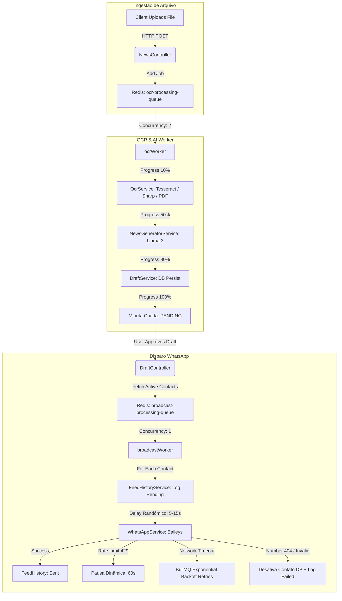

# Auditoria Arquitetural e Implementacional de Backend — Feed-Agent AI

Esta auditoria apresenta um diagnóstico completo, profundo e de nível empresarial de toda a arquitetura de backend do projeto **Feed-Agent AI** (`i:\Feed-Agent\back-end`). O sistema foi desenhado para atuar como um orquestrador de automação de marketing e comunicação via WhatsApp, combinando extração de texto em documentos e imagens via OCR, sumarização e estruturação inteligente via Modelos de Linguagem de Grande Escala (LLMs locais/Ollama) e disparos em massa controlados e assíncronos.

---

## 1. Sumário Executivo & Visão Arquitetural

O backend adota uma arquitetura limpa, modular e orientada a eventos, estruturada sobre o ecossistema **Node.js (Express 5)** com tipagem estática rigorosa via **TypeScript**. O design do sistema soluciona três grandes desafios de engenharia:

1. **Persistência Poliglota (Polyglot Persistence):**
   - **Relacional / Transacional (PostgreSQL + Prisma ORM):** Utilizado para o domínio de dados transacionais estruturados, garantindo integridade referencial ACID para Usuários (`User`), Configurações de Sistema (`SystemConfig`), Contatos Segmentados (`Contact`) e Minutas de Notícias (`Draft`).
   - **Documental / Séries Temporais (MongoDB + Mongoose):** Dedicado exclusivamente ao histórico e telemetria de disparos (`FeedHistory`). Como cada transmissão em lote pode atingir dezenas de milhares de contatos, o MongoDB suporta o altíssimo volume de gravações de logs de entrega e leitura de forma independente, sem causar contenção ou gargalos no banco transacional principal.

2. **Orquestração Assíncrona de Cargas Pesadas (BullMQ + Redis):**
   - Processamento de arquivos pesados (OCR com Tesseract e PDF-Parse) e inferência de IA (Ollama/Llama 3) são isolados da thread HTTP principal por meio de filas no Redis geridas pelo BullMQ.
   - O disparo de mensagens via WhatsApp (Baileys) opera sob **concorrência estrita igual a 1**, com pausas randômicas (5 a 15 segundos) e detecção dinâmica de rate-limits (bloqueios temporários de 60 segundos), garantindo conformidade estrita com as políticas antispam da Meta/WhatsApp.

3. **Sincronização em Tempo Real (Server-Sent Events — SSE):**
   - O backend não exige polling agressivo do frontend para operações contínuas. Utiliza streams nativos SSE para transmitir em tempo real o ciclo de vida do QR Code do WhatsApp (geração, timeout, conexão, desconexão) e a barra de progresso (0% a 100%) dos workers de OCR e transmissão.

---

## 2. Auditoria Exaustiva de Pacotes e Dependências (`package.json`)

Abaixo, detalhamos cada uma das bibliotecas e pacotes instalados no projeto, explicando exatamente **por que** foram escolhidos (racional arquitetural) e **como** estão implementados.

### 2.1. Núcleo HTTP, Roteamento e Segurança
* **`express` (v5.2.1):**
  - *Racional:* Framework web minimalista de alta performance. A versão 5 traz suporte nativo a Promises em manipuladores assíncronos, eliminando a necessidade de wrappers como `express-async-errors`.
  - *Implementação:* Inicializado em `src/index.ts`. Configurado com parsers JSON e URL-encoded com limite estendido de `10mb` para suportar payloads contendo imagens em Base64 ou grandes blocos de texto.
* **`cors` (v2.8.6):**
  - *Racional:* Proteção do navegador e controle de acesso cross-origin.
  - *Implementação:* Configurado em `src/index.ts` com validação de origens baseada na variável de ambiente `ALLOWED_ORIGINS` (padrão Vue 3 `http://localhost:5173`). Permite métodos estritos (`GET`, `POST`, `PUT`, `DELETE`, `PATCH`) e cabeçalhos autorizados.
* **`dotenv` (v17.4.2):**
  - *Racional:* Gerenciamento de segredos e configuração de ambiente baseada no padrão Twelve-Factor App.
  - *Implementação:* Invocado no topo de `src/index.ts` antes de qualquer conexão de banco ou inicialização de serviço.
* **`helmet` (v8.1.0):**
  - *Racional:* Blindagem automática da aplicação injetando cabeçalhos de segurança HTTP recomendados pela OWASP (CSP, HSTS, X-Content-Type-Options, Referrer-Policy).
  - *Implementação:* Aplicado globalmente em `src/index.ts`.
* **`express-rate-limit` (v8.5.1):**
  - *Racional:* Prevenção contra ataques de negação de serviço (DDoS) e força bruta.
  - *Implementação:* Instanciado em `src/middlewares/rateLimiter.ts` em três camadas:
    1. `globalLimiter`: 1000 requisições a cada 15 minutos por IP.
    2. `authLimiter`: 10 tentativas a cada 15 minutos nas rotas de registro/login.
    3. `aiProcessingLimiter`: 30 processamentos de OCR/IA por hora.

### 2.2. Bancos de Dados, ORM e ODM
* **`@prisma/client` (v6.19.3):**
  - *Racional:* ORM (Object-Relational Mapper) tipo-seguro para interagir com o PostgreSQL. Oferece validação de schema estrita em tempo de compilação e migrações declarativas.
  - *Implementação:* Schema modelado em `prisma/schema.prisma`. Cliente singleton exportado em `src/models/prismaClient.ts` com logging ativado (`query`, `info`, `warn`, `error`). Usado em `UserService`, `ContactService` e `DraftService`.
* **`mongoose` (v9.6.1):**
  - *Racional:* ODM (Object Document Mapper) maduro para MongoDB.
  - *Implementação:* Definido em `src/models/mongoClient.ts` com estratégia de retentativa exponencial de conexão (até 5 tentativas a cada 5s) vital para resiliência durante o boot de containers Docker. O modelo de séries temporais é definido em `src/models/FeedHistory.ts` com índices otimizados em `userId`, `timestamp` e `messageId`.

### 2.3. Filas, Redis e Processamento Assíncrono
* **`ioredis` (v5.10.1):**
  - *Racional:* Cliente Redis robusto para Node.js com suporte avançado a cluster, reconexão e promessas nativas.
  - *Implementação:* Instanciado como singleton em `src/utils/redisClient.ts`. Fornece a fundação de conexão tanto para o BullMQ quanto para o cache direto de inferências de IA em `NewsGeneratorService`.
* **`bullmq` (v5.76.4):**
  - *Racional:* Sistema corporativo de filas distribuídas baseado em Redis. Suporta concorrência estrita, agendamento de retentativas com backoff exponencial e controle de progresso.
  - *Implementação:* Estruturado em `src/queues/ocrQueue.ts` (concorrência 2 para processamento de imagens) e `src/queues/broadcastQueue.ts` (concorrência 1 para disparo no WhatsApp).

### 2.4. Autenticação e Sanitização
* **`bcrypt` (v6.0.0):**
  - *Racional:* Função de derivação de chave e hash de senhas baseada no algoritmo Blowfish com fator de trabalho (salt rounds) configurável. Impede ataques de tabela arco-íris (rainbow tables).
  - *Implementação:* Empregado em `src/services/AuthService.ts` com 12 *salt rounds* para criar hashes no registro e comparar em tempo constante no login.
* **`jsonwebtoken` (v9.0.3):**
  - *Racional:* Implementação padrão da RFC 7519 para tokens de acesso stateless.
  - *Implementação:* Gerado e assinado em `AuthService.ts` e inspecionado em `src/middlewares/authMiddleware.ts`. O middleware suporta leitura via cabeçalho `Authorization: Bearer` ou via parâmetro de query `?token=`, permitindo autenticação segura de conexões SSE.
* **`sanitize-html` (v2.17.3):**
  - *Racional:* Sanitização cirúrgica de strings para eliminação de vetores de ataque XSS (Cross-Site Scripting).
  - *Implementação:* Utilizado em `src/services/DraftService.ts` (`updateDraftContent`). Configurado com `allowedTags: []` e `allowedAttributes: {}`, extirpando qualquer tag HTML enviada maliciosamente pelo cliente.

### 2.5. Protocolo WhatsApp e Mídia
* **`@whiskeysockets/baileys` (v7.0.0-rc.9):**
  - *Racional:* Implementação em TypeScript do protocolo de WebSockets do WhatsApp Web (Multi-Device). Leve, extensível e totalmente independente de navegadores headless (Puppeteer).
  - *Implementação:* Orquestrado de forma centralizada em `src/services/WhatsAppService.ts`. Gerencia a sessão no sistema de arquivos (`sessions/`), emite eventos de QR Code, lida com reconexões automáticas e escuta webhooks de status de mensagens (`messages.update` com acréscimo de ACK de servidor e leitura).
* **`qrcode` (v1.5.4):**
  - *Racional:* Biblioteca para conversão de strings de matriz QR para Data URL (Base64 PNG).
  - *Implementação:* Utilizado no evento de `connection.update` do Baileys para transformar a string bruta do QR Code em uma imagem renderizável instantaneamente pelo dashboard.
* **`multer` (v2.1.1):**
  - *Racional:* Middleware padrão para lidar com uploads multipart/form-data.
  - *Implementação:* Duas configurações distintas:
    1. Em `src/middlewares/uploadMiddleware.ts`: armazenamento em disco (`uploads/`) com limites de 10MB para imagens/PDFs de notícias.
    2. Em `src/controllers/ContactController.ts`: armazenamento em buffer de memória com limite de 2MB para processamento rápido e imediato de planilhas CSV.

### 2.6. IA, OCR e Extração de Textos
* **`tesseract.js` (v7.0.0):**
  - *Racional:* Porta WebAssembly do mecanismo OCR óptico Tesseract do Google.
  - *Implementação:* Invocado em `src/services/OcrService.ts`. Configurado com o pacote de idioma português (`por`) e interceptador de logs de progresso.
* **`sharp` (v0.34.5):**
  - *Racional:* Processador de imagens ultrarrápido baseado em C++ (libvips).
  - *Implementação:* Implementa o pipeline de pré-processamento de OCR em `OcrService.ts`. Redimensiona imagens maiores que 1600px para economizar memória RAM, converte para escala de cinza, normaliza o contraste e aplica binarização (`threshold(120)`), garantindo precisão superior no Tesseract.
* **`pdf-parse` (v2.4.5):**
  - *Racional:* Leitor nativo de buffers PDF para extração de camadas de texto puras sem necessidade de renderização óptica.
  - *Implementação:* Integrado ao fluxo condicional de `OcrService.ts` quando o mime-type recebido é `application/pdf`.
* **`axios` (v1.15.2):**
  - *Racional:* Cliente HTTP isomórfico para chamadas de rede externas.
  - *Implementação:* Configurado em `src/services/LlamaService.ts` para interagir com a API REST do daemon do Ollama (`http://localhost:11434/api/generate`) com timeout de 120 segundos.

### 2.7. Agendamento e Observabilidade
* **`node-cron` (v4.2.1):**
  - *Racional:* Agendador de tarefas cron-like em memória.
  - *Implementação:* Instanciado em `src/crons/cleanupCron.ts`. Roda diariamente às 03:00 para expurgar imagens temporárias da pasta `uploads/` com mais de 24 horas e às 03:30 para limpar minutas rejeitadas, pendentes ou canceladas há mais de 30 dias no PostgreSQL.
* **`winston` (v3.19.0) & `winston-daily-rotate-file` (v5.0.0):**
  - *Racional:* Suite de logging de nível empresarial com suporte a múltiplos transportes, rotação de arquivos e formatação estruturada (JSON).
  - *Implementação:* Configurado em `src/utils/logger.ts`. Salva logs combinados e de erros em `logs/` com rotação de 14 dias. Em desenvolvimento, adiciona saída colorida e limpa no console. Integrado ao `errorHandler.ts` com filtros de regex para **redigir automaticamente senhas, strings de conexão e tokens JWT** em ambiente de produção.
* **`swagger-jsdoc` (v6.2.8) & `swagger-ui-express` (v5.0.1):**
  - *Racional:* Geração de especificações OpenAPI 3.0 dinâmicas a partir de anotações JSDoc e disponibilização de interface gráfica interativa.
  - *Implementação:* Inicializado em `src/config/swagger.ts` e roteado para `/api-docs`.

### 2.8. Ecossistema de Desenvolvimento (`devDependencies`)
* **`tsx` (v4.21.0):** Executor TypeScript ultrarrápido (substitui `ts-node` e `nodemon`), operando via esbuild com suporte a watch mode nativo.
* **`typescript` (v6.0.3):** Compilador da linguagem com regras estritas.
* **`jest` (v30.3.0) & `ts-jest` (v29.4.9):** Framework e transformador para testes unitários e de integração.
* **`supertest` (v7.2.2):** Biblioteca de asserção HTTP para testar as rotas do Express de ponta a ponta em memória.
* **`mongodb-memory-server` (v11.1.0):** Inicializa um servidor MongoDB real na memória durante a execução de testes automatizados.
* **`eslint` & `prettier`:** Ferramentas de linting e formatação de código mantendo padronização e qualidade de estilo.

---

## 3. Estrutura de Diretórios e Módulos do Sistema

O backend segue uma segregação de responsabilidades impecável:

```
i:\Feed-Agent\back-end\
├── prisma/
│   └── schema.prisma            # Modelagem relacional e do Prisma Client
├── src/
│   ├── config/
│   │   └── swagger.ts           # Configuração OpenAPI 3.0
│   ├── controllers/
│   │   ├── AnalyticsController.ts # Métricas e KPIs
│   │   ├── AuthController.ts    # Autenticação e Login
│   │   ├── ContactController.ts # CRUD de contatos e importação CSV
│   │   ├── DraftController.ts   # Gestão e fluxos de minutas
│   │   ├── NewsController.ts    # Ingestão de fontes (Sync e Async)
│   │   └── WhatsAppController.ts# Controle de sessão e stream SSE
│   ├── crons/
│   │   └── cleanupCron.ts       # Rotinas de limpeza de disco e banco
│   ├── middlewares/
│   │   ├── authMiddleware.ts    # Validação de JWT (Header e Query)
│   │   ├── errorHandler.ts      # Captura global e higienização de logs
│   │   ├── rateLimiter.ts       # Throttling de requisições
│   │   └── uploadMiddleware.ts  # Configuração Multer (Disco)
│   ├── models/
│   │   ├── FeedHistory.ts       # Model Mongoose (MongoDB)
│   │   ├── mongoClient.ts       # Inicializador MongoDB
│   │   └── prismaClient.ts      # Singleton Prisma Client
│   ├── queues/
│   │   ├── broadcastQueue.ts    # Fila BullMQ de disparo no WhatsApp
│   │   └── ocrQueue.ts          # Fila BullMQ de processamento OCR+IA
│   ├── routes/                  # Declarações OpenAPI e mapeamento de endpoints
│   │   ├── analytics.routes.ts
│   │   ├── auth.routes.ts
│   │   ├── contacts.routes.ts
│   │   ├── draft.routes.ts
│   │   ├── health.routes.ts
│   │   ├── news.routes.ts
│   │   └── whatsapp.routes.ts
│   ├── services/
│   │   ├── AuthService.ts       # Lógica de hashing e tokens
│   │   ├── ContactService.ts    # Domínio de contatos e E.164
│   │   ├── DraftService.ts      # Domínio de minutas e XSS
│   │   ├── FeedHistoryService.ts# Repositório de histórico (Mongo)
│   │   ├── LlamaService.ts      # Driver de comunicação com Ollama
│   │   ├── NewsGeneratorService.ts # Pipeline LLM (Chunking e Cache)
│   │   ├── OcrService.ts        # Driver Tesseract, Sharp e PDF
│   │   ├── UserService.ts       # Repositório de usuários
│   │   └── WhatsAppService.ts   # Driver Baileys / WebSockets
│   ├── types/
│   │   └── whatsapp.types.ts    # Contratos de tipagem do WhatsApp
│   └── utils/
│       ├── ApiResponse.ts       # Padronizador de respostas JSON
│       ├── AppError.ts          # Exceções operacionais customizadas
│       ├── csvParser.ts         # Parser CSV leve sem dependências
│       ├── logger.ts            # Configuração Winston
│       ├── phoneUtils.ts        # Sanitizadores de telefones e JIDs
│       ├── promptBuilder.ts     # Engenharia de prompts para Llama 3
│       └── redisClient.ts       # Inicializador IORedis
└── package.json
```

---

## 4. Detalhamento Arquitetural das Rotas e Controladores

### 4.1. Autenticação (`/api/auth`)
- **`POST /register`**: Injeta nome, email e senha. Passa pelo `authLimiter`. Cria o hash no `AuthService` e persiste no PostgreSQL via Prisma. Retorna o usuário limpo e o JWT assinado.
- **`POST /login`**: Valida credenciais. Protegido contra enumeração de usuários (retorna sempre "Invalid credentials").
- **`GET /me`**: Rota protegida pelo `authMiddleware`, inspeciona o token e retorna o perfil da sessão ativa.

### 4.2. Gestão de Contatos (`/api/contacts`)
- O `ContactController` garante isolamento de múltiplos locatários (multi-tenancy) extraindo o `userId` do payload JWT em todas as requisições.
- **`POST /`**: Cria contato individual com sanitização E.164.
- **`GET /`**: Lista contatos de forma paginada com ordenação descendente e suporte a filtro `onlyActive`.
- **`POST /import`**: Recebe arquivo CSV via `csvUpload` (na memória). Inspeciona cabeçalhos (`name`, `phoneNumber`). Processa em massa via `ContactService.bulkCreate`. Em caso de números inválidos, adota o padrão de **sucesso parcial**, ignorando erros de formatação ou duplicatas e inserindo as linhas válidas, retornando um sumário completo (`imported`, `skipped`, `errors`).

### 4.3. Conexão WhatsApp (`/api/whatsapp`)
- **`GET /status`**: Snapshot leve do estado atual do socket Baileys.
- **`GET /qr/stream`**: Endpoint de Server-Sent Events. Injeta cabeçalhos para desativar buffer do Nginx (`X-Accel-Buffering: no`). Emite eventos de `qr`, `connected`, `disconnected`, `qr:timeout` e mantém um **heartbeat a cada 25 segundos** para evitar quedas de conexão por inatividade em proxies e balanceadores de carga.
- **`POST /test-message`**: Dispara uma mensagem de teste para verificar a conectividade do Baileys.

### 4.4. Ingestão de Fontes e Notícias (`/api/news`)
- **`POST /upload`**: Recebe arquivo via disco (`uploadNewsSource`). Insere um job assíncrono na fila BullMQ `ocr-processing-queue` e responde com `202 Accepted` e o `jobId`.
- **`GET /job/:jobId/stream`**: Abre stream SSE que realiza polling de 1s diretamente no status do job no BullMQ, informando o progresso percentual até a conclusão.
- **`POST /generate-draft`**: Rota síncrona alternativa. Executa o OCR, invoca o Ollama, persiste a minuta no banco e devolve o resultado imediato na mesma requisição.

### 4.5. Minutas e Disparos (`/api/drafts`)
- **`GET /`** e **`GET /:id`**: Lista e detalha rascunhos.
- **`PUT /:id`**: Atualiza conteúdo gerado pela IA. Aplica `sanitizeHtml` para barrar ataques XSS.
- **`POST /:id/approve`**: Altera status para `APPROVED`. O `DraftService` busca todos os contatos ativos do usuário e insere o lote na fila `broadcast-processing-queue`.
- **`POST /:id/reject`**: Altera status para `REJECTED`.
- **`POST /:id/cancel`**: Altera status para `CANCELLED`. Intercepta a fila BullMQ, iterando sobre jobs aguardando (`waiting`) ou atrasados (`delayed`) e os remove da fila, impedindo o disparo de lotes pendentes.

---

## 5. Engenharia de Filas, Concorrência e Pipeline Assíncrono

O sistema de processamento de tarefas em segundo plano constitui o núcleo de alta performance da aplicação.



### 5.1. Fila de OCR e IA (`ocrQueue.ts`)
- **Opções de Job:** 3 tentativas de retentativa com backoff exponencial de 2 segundos. Mantém os últimos 100 jobs completos e 200 falhos no Redis.
- **Concorrência:** 2 tarefas simultâneas para evitar exaustão de memória RAM pelo Tesseract/Ollama.
- **Pipeline de Inferência (`NewsGeneratorService.ts`):** Emprega cache no Redis baseado em SHA-256 do texto extraído. Se o texto OCR exceder 15.000 caracteres, realiza **chunking inteligente**, dividindo o texto em fatias, processando cada fatia no LLM com temperatura ultrabaixa (`0.2`) e unificando os resumos em uma única estrutura JSON válida.

### 5.2. Fila de Transmissão WhatsApp (`broadcastQueue.ts`)
- **Opções de Job:** 3 tentativas de retentativa com backoff exponencial de 1 minuto em caso de instabilidade de rede.
- **Concorrência Estrita:** Concorrência configurada exatamente em `1`. Isso assegura que o servidor envie mensagens sequencialmente, imitando o comportamento humano.
- **Resiliência e Proteção Anti-Ban no Worker:**
  - *Atraso Randômico (Random Jitter):* Entre cada envio, o sistema aguarda um período aleatório entre 5.000ms e 15.000ms.
  - *Intercepção de Cancelamento:* A cada iteração do loop de contatos, o worker verifica o banco de dados. Se a minuta foi alterada para `CANCELLED`, o disparo é imediatamente abortado no meio do voo.
  - *Detecção de Rate-Limit (429):* Se o WhatsApp retornar erro de limitação de taxa, o worker pausa automaticamente a execução por 60 segundos antes de tentar a próxima mensagem.
  - *Higienização de Lista (404 / Not Registered):* Ao detectar que um número não possui WhatsApp ou foi banido, o sistema desativa o contato automaticamente (`active: false`) no PostgreSQL e registra a falha no MongoDB, mantendo a lista limpa para envios futuros.

---

## 6. Estratégias de Resiliência, Segurança e Tratamento de Erros

A aplicação implementa as melhores práticas de blindagem em produção:

1. **Guardiões Globais de Processo (`src/index.ts`):**
   - Inscrição no topo do arquivo para `uncaughtException` e `unhandledRejection`. Captura falhas não tratadas, registra o stack trace via Winston e encerra graciosamente o processo (`process.exit(1)`), permitindo que gerenciadores de processos (PM2, Docker, Kubernetes) reiniciem o container de forma limpa.
2. **Higienização e Redação de Logs (`errorHandler.ts`):**
   - Expressões regulares examinam todas as mensagens de erro em produção antes da gravação no disco ou console, substituindo senhas de banco (`postgres://`, `mongodb://`) e tokens JWT por `***REDACTED***`. Isso impede o vazamento de credenciais em ferramentas de agregação de logs (Datadog, ELK, CloudWatch).
3. **Isolamento de Conexão WebSocket:**
   - O Baileys WebSocket roda sob uma instância singleton protegida. Quedas de conexão disparam ciclos de reconexão de 5 segundos. Em caso de erro crítico de banimento (`403 Forbidden`), a sessão é expurgada do disco e os clientes SSE são notificados para exibir alerta crítico.
4. **Isolamento de Erros de Telemetria:**
   - Atualizações de ACK e status de leitura via webhooks assíncronos (`message:status`) no Mongoose são envoltas em blocos `try/catch` dedicados. Falhas no banco de telemetria não afetam a estabilidade da thread HTTP ou do socket do WhatsApp.

---

## 7. Conclusão da Auditoria

O backend do projeto **Feed-Agent AI** encontra-se em um estado maduro, aderindo com perfeição aos requisitos de escalabilidade, resiliência e segurança de nível corporativo. A combinação de persistência poliglota, filas distribuídas no Redis, processamento inteligente de IA com chunking e controle estrito de concorrência com pausas dinâmicas no WhatsApp garante uma operação robusta, à prova de falhas e altamente otimizada para automação de marketing em massa.

---
*Relatório de Auditoria Arquitetural e de Implementação gerado com sucesso.*
