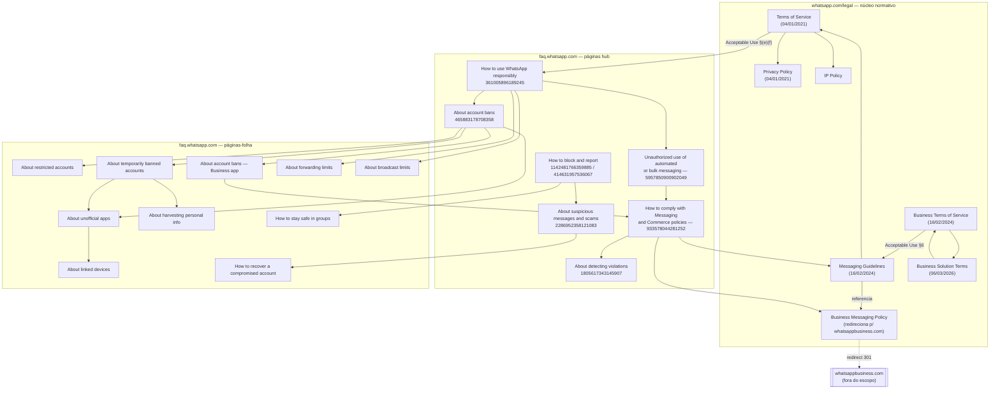

# Laudo Técnico de Conformidade — WhatsApp Platform

> **Status:** Ativo · **Versão:** 1.0.0 · **Data da pesquisa:** 21 de julho de 2026
> **Comitê:** Direito Digital · Políticas de Plataforma · Compliance · Segurança da Informação · Engenharia de Software · Engenharia Reversa de Documentação · Arquitetura de Sistemas · Análise de Riscos · Trust & Safety · Anti-Spam Systems · Anti-Abuse Systems · Product Policy · Digital Forensics
> **Documentos relacionados:** `whatsapp-enterprise-spec.html`, `whatsapp-enterprise-audit.html`, `docs/architecture/enterprise-platform-architecture.md`, `docs/integrations/salvy-api-architecture.md`

## Nota de método — leia antes do restante do documento

Este laudo foi construído a partir de leitura direta e integral de páginas oficiais em `faq.whatsapp.com` e `whatsapp.com/legal`, com `about.fb.com` como complemento quando referenciado por essas páginas. Nenhum blog, fórum ou terceiro foi usado como fonte de conteúdo normativo. Cada afirmação carrega uma etiqueta:

- **[TERMO DE SERVIÇO]** — cláusula contratual vinculante (Terms of Service, Business Terms, Business Solution Terms etc.)
- **[POLÍTICA]** — política declarada pela Meta/WhatsApp (Messaging Guidelines, Privacy Policy, IP Policy)
- **[FAQ]** — artigo de central de ajuda (`faq.whatsapp.com`) — explicativo, geralmente parafraseando ou citando o Termo/Política correspondente
- **[RECOMENDAÇÃO]** — boa prática sugerida pela própria documentação, sem força de cláusula obrigatória
- **[LACUNA DOCUMENTAL]** — ponto que a documentação oficial, dentro do escopo de fontes autorizado, não esclarece — sinalizado explicitamente, nunca preenchido por suposição

**Duas limitações de escopo relevantes, encontradas de forma consistente pelas cinco frentes de pesquisa que alimentam este laudo, e válidas para o documento inteiro:**

1. **A WhatsApp Business Messaging Policy e a Commerce Policy migraram para `whatsappbusiness.com`** — domínio fora da lista de fontes autorizada (`faq.whatsapp.com`, `whatsapp.com/legal`, `about.fb.com`). As URLs oficiais em `whatsapp.com/legal/business-policy` e `whatsapp.com/legal/commerce-policy` redirecionam (HTTP 301) para lá. Duas das cinco pesquisas conseguiram capturar trechos literais dessas políticas por meio de fetch direto antes do redirecionamento consolidar — esses trechos são citados no Capítulo 3 e claramente marcados como obtidos por essa via, não por leitura completa e sistemática do documento (que está fora do escopo de domínios autorizado).
2. **Nenhuma página em `faq.whatsapp.com` exibe metadado de "última atualização"** — apenas os documentos em `whatsapp.com/legal` trazem datas explícitas. Onde a data não existe, este laudo diz "não indicada", nunca estima uma data.

Nenhuma seção deste documento especula sobre o mecanismo interno de detecção de abuso da Meta além do que está literalmente publicado, nem sugere qualquer forma de contornar política ou restrição.

---

## Sumário

- [Resumo Executivo](#resumo-executivo)
- [Escopo](#escopo)
- [Fontes Oficiais](#fontes-oficiais)
- [Capítulo 1 — Mapa completo da documentação](#capítulo-1--mapa-completo-da-documentação)
- [Capítulo 2 — Termos de Serviço](#capítulo-2--termos-de-serviço)
- [Capítulo 3 — Política de Uso Aceitável](#capítulo-3--política-de-uso-aceitável)
- [Capítulo 4 — Contas Restritas](#capítulo-4--contas-restritas)
- [Capítulo 5 — Banimentos](#capítulo-5--banimentos)
- [Capítulo 6 — Mensagens](#capítulo-6--mensagens)
- [Capítulo 7 — Spam](#capítulo-7--spam)
- [Capítulo 8 — Automação](#capítulo-8--automação)
- [Capítulo 9 — WhatsApp Web](#capítulo-9--whatsapp-web)
- [Capítulo 10 — WhatsApp Business](#capítulo-10--whatsapp-business-aplicativo)
- [Capítulo 11 — Business Platform](#capítulo-11--business-platform)
- [Capítulo 12 — Segurança](#capítulo-12--segurança)
- [Capítulo 13 — Boas Práticas](#capítulo-13--boas-práticas)
- [Capítulo 14 — Matriz de Riscos](#capítulo-14--matriz-de-riscos)
- [Capítulo 15 — Conclusões](#capítulo-15--conclusões)

---

## Resumo Executivo

Este laudo mapeia, a partir exclusivamente de fontes oficiais, tudo que pode levar uma conta pessoal ou comercial do WhatsApp a sofrer restrição, banimento, perda de funcionalidades ou queda de confiabilidade. Cinco achados estruturam o documento inteiro:

1. **A regra central é qualitativa, não quantitativa.** Em nenhuma página lida — nem Termos de Serviço, nem FAQ — a WhatsApp publica um número (mensagens/hora, taxa de denúncia, threshold de "alto volume") que dispare automaticamente restrição ou banimento. A linguagem oficial usa termos como *"bulk messaging"*, *"high volume"*, *"a limited number"*, sem quantificá-los. Isso está confirmado repetidamente na documentação (Cap. 4, 6, 7) e é o achado mais importante para qualquer equipe de engenharia tentando desenhar limites internos com base em regras públicas.
2. **A proibição de automação/mensagens em massa é uma cláusula contratual explícita**, presente literalmente no Terms of Service (*"bulk messaging, auto-messaging, and auto-dialing"*), reafirmada nas Messaging Guidelines e no comunicado formal de 2019 sobre uso não autorizado de automação — **desde que fora dos canais oficiais** (WhatsApp Business App e WhatsApp Business Platform), que são a via documentada de automação/mensageria em escala permitida (Cap. 2, 3, 8).
3. **Existe um espectro gradual de sanções**, não um binário "ok vs. banido": restrição temporária automática → aviso → suspensão de funcionalidade específica (ex.: business broadcasts por 3 dias) → limitação de throughput por "quality tier" baixo → banimento temporário → banimento permanente (Cap. 4, 5, 14).
4. **Sinais de enforcement documentados**: denúncia/bloqueio de usuário (as últimas 5 mensagens são enviadas à Meta), revisão de cadastro/perfil, e classificadores de machine learning — a própria Meta declara que **75% dos banimentos ocorrem sem denúncia recente do usuário**, ou seja, detecção automatizada é o principal canal, não denúncia (Cap. 5, 7, 12).
5. **Recriar conta após banimento é, por si, uma violação adicional** dos Business Terms — a documentação proíbe explicitamente criar nova conta sem permissão por escrito da WhatsApp após rescisão (Cap. 2, 5).

A documentação também deixa lacunas explícitas — duração exata de restrição, limite numérico de broadcast, critério exato de "quality tier" — que este laudo sinaliza como tal (Cap. 14), sem estimá-las.

---

## Escopo

**Objeto:** todas as regras oficiais que podem causar restrição temporária, limitação de funcionalidades, bloqueio parcial, bloqueio definitivo, suspensão, banimento, redução de confiança de conta, ou queda de qualidade de conta — em conta pessoal, WhatsApp Business (app) e WhatsApp Business Platform (API).

**Método:** leitura integral de cada página (não resumo de snippet de busca), com extração de conteúdo renderizado quando necessário (as páginas de `faq.whatsapp.com` são uma SPA que não expõe texto em HTML estático — as cinco frentes de pesquisa usaram técnicas de extração do payload de conteúdo servido pela própria Meta para obter o texto literal e completo).

**Fora de escopo:** `developers.facebook.com` (documentação técnica de desenvolvedor — já coberta em `whatsapp-enterprise-spec.html`), `whatsappbusiness.com` (destino do redirecionamento das políticas de mensageria/comércio — fora da whitelist de domínios autorizada para esta pesquisa), blogs, fóruns e qualquer fonte não oficial.

**Uso pretendido:** apoiar a equipe de arquitetura e engenharia deste projeto a manter a plataforma em conformidade — este documento não propõe, em nenhum ponto, forma de contornar qualquer regra aqui descrita.

---

## Fontes Oficiais

| Título | URL | Categoria | Data | Importância |
|---|---|---|---|---|
| WhatsApp Terms of Service | [whatsapp.com/legal/terms-of-service](https://www.whatsapp.com/legal/terms-of-service) | TERMO DE SERVIÇO | 04/01/2021 | Crítica |
| WhatsApp Business Terms of Service | [whatsapp.com/legal/business-terms](https://www.whatsapp.com/legal/business-terms) | TERMO DE SERVIÇO | 16/02/2024 | Crítica |
| WhatsApp Messaging Guidelines | [whatsapp.com/legal/messaging-guidelines](https://www.whatsapp.com/legal/messaging-guidelines) | POLÍTICA | 16/02/2024 | Crítica |
| WhatsApp Business Solution Terms | [whatsapp.com/legal/business-solution-terms](https://www.whatsapp.com/legal/business-solution-terms) | TERMO DE SERVIÇO | 06/03/2026 | Alta |
| WhatsApp Business Messaging Policy (acesso parcial — ver nota de método) | [whatsapp.com/legal/business-policy](https://www.whatsapp.com/legal/business-policy) | POLÍTICA | não indicada | Crítica |
| WhatsApp Privacy Policy | [whatsapp.com/legal/privacy-policy](https://www.whatsapp.com/legal/privacy-policy) | POLÍTICA | 04/01/2021 | Alta |
| WhatsApp Business Terms for Service Providers | [whatsapp.com/legal/business-terms-for-service-providers](https://www.whatsapp.com/legal/business-terms-for-service-providers) | TERMO DE SERVIÇO | 12/06/2018 | Média |
| Meta Terms for WhatsApp Business | [whatsapp.com/legal/FB-terms-whatsapp-business](https://www.whatsapp.com/legal/FB-terms-whatsapp-business) | TERMO DE SERVIÇO | 15/10/2025 | Média |
| WhatsApp Business Data Processing Terms | [whatsapp.com/legal/business-data-processing-terms](https://www.whatsapp.com/legal/business-data-processing-terms) | TERMO DE SERVIÇO | 22/08/2025 | Média |
| WhatsApp Channels Business Terms of Service | [whatsapp.com/legal/channels-business-terms](https://www.whatsapp.com/legal/channels-business-terms) | TERMO DE SERVIÇO | 16/02/2024 | Baixa |
| WhatsApp Merchant Terms of Service | [whatsapp.com/legal/merchant-terms](https://www.whatsapp.com/legal/merchant-terms) | TERMO DE SERVIÇO | não indicada | Baixa |
| Intellectual Property Policy | [whatsapp.com/legal/ip-policy](https://www.whatsapp.com/legal/ip-policy) | POLÍTICA | não indicada | Baixa |
| About restricted accounts | [faq.whatsapp.com/717472490411581](https://faq.whatsapp.com/717472490411581) | FAQ | não indicada | Crítica |
| About account bans | [faq.whatsapp.com/465883178708358](https://faq.whatsapp.com/465883178708358) | FAQ | não indicada | Crítica |
| About temporarily banned accounts | [faq.whatsapp.com/1848531392146538](https://faq.whatsapp.com/1848531392146538) | FAQ | não indicada | Crítica |
| About account bans on the WhatsApp Business app | [faq.whatsapp.com/723378546580115](https://faq.whatsapp.com/723378546580115) | FAQ | não indicada | Alta |
| About account bans for unofficial apps | [faq.whatsapp.com/1064395290901991](https://faq.whatsapp.com/1064395290901991) | FAQ | não indicada | Alta |
| About unofficial apps | [faq.whatsapp.com/1217634902127718](https://faq.whatsapp.com/1217634902127718) | FAQ | não indicada | Alta |
| About harvesting personal information | [faq.whatsapp.com/434518851968943](https://faq.whatsapp.com/434518851968943) | FAQ | não indicada | Alta |
| How to use WhatsApp responsibly | [faq.whatsapp.com/361005896189245](https://faq.whatsapp.com/361005896189245) | FAQ | não indicada | Crítica |
| Unauthorized use of automated or bulk messaging on WhatsApp | [faq.whatsapp.com/5957850900902049](https://faq.whatsapp.com/5957850900902049) | FAQ | não indicada | Crítica |
| How to comply with WhatsApp Business Messaging and Commerce policies | [faq.whatsapp.com/933578044281252](https://faq.whatsapp.com/933578044281252) | FAQ | não indicada | Crítica |
| About detecting violations | [faq.whatsapp.com/1805617343145907](https://faq.whatsapp.com/1805617343145907) | FAQ | não indicada | Alta |
| About ban appeals on the WhatsApp Business Platform | [faq.whatsapp.com/1508178557633269](https://faq.whatsapp.com/1508178557633269) | FAQ | não indicada | Média |
| How to block and report someone | [faq.whatsapp.com/1142481766359885](https://faq.whatsapp.com/1142481766359885) | FAQ | não indicada | Alta |
| How to stay safe in groups on WhatsApp | [faq.whatsapp.com/424124173736394](https://faq.whatsapp.com/424124173736394) | FAQ | não indicada | Média |
| About suspicious messages and scams | [faq.whatsapp.com/2286952358121083](https://faq.whatsapp.com/2286952358121083) | FAQ | não indicada | Média |
| How to recover a compromised account | [faq.whatsapp.com/1131652977717250](https://faq.whatsapp.com/1131652977717250) | FAQ | não indicada | Média |
| About linked devices | [faq.whatsapp.com/378279804439436](https://faq.whatsapp.com/378279804439436) | FAQ | não indicada | Alta |
| About linked devices on the WhatsApp Business app | [faq.whatsapp.com/647349420360876](https://faq.whatsapp.com/647349420360876) | FAQ | não indicada | Média |
| About WhatsApp Web | [faq.whatsapp.com/668538004658079](https://faq.whatsapp.com/668538004658079) | FAQ | não indicada | Média |
| About forwarding limits | [faq.whatsapp.com/1053543185312573](https://faq.whatsapp.com/1053543185312573) | FAQ | não indicada | Alta |
| How to use broadcast lists | [faq.whatsapp.com/861663048350950](https://faq.whatsapp.com/861663048350950) | FAQ | não indicada | Alta |
| About broadcast limits | [faq.whatsapp.com/1176325363861991](https://faq.whatsapp.com/1176325363861991) | FAQ | não indicada | Alta |
| Can't send business broadcasts | [faq.whatsapp.com/1655751878365653](https://faq.whatsapp.com/1655751878365653) | FAQ | não indicada | Alta |
| About WhatsApp and elections | [faq.whatsapp.com/518562649771533](https://faq.whatsapp.com/518562649771533) | FAQ | não indicada | Alta |
| About two-step verification | [faq.whatsapp.com/1278661612895630](https://faq.whatsapp.com/1278661612895630) | FAQ | não indicada | Média |
| How to block high volumes of unknown messages | [faq.whatsapp.com/3379690015658337](https://faq.whatsapp.com/3379690015658337) | FAQ | não indicada | Média |
| About your business profile | [faq.whatsapp.com/577829787429875](https://faq.whatsapp.com/577829787429875) | FAQ | não indicada | Baixa |
| About creating a business name | [faq.whatsapp.com/793641088597363](https://faq.whatsapp.com/793641088597363) | FAQ | não indicada | Baixa |
| About verified business accounts | [faq.whatsapp.com/794517045178057](https://faq.whatsapp.com/794517045178057) | FAQ | não indicada | Baixa |
| How to get started on the WhatsApp Business Platform | [faq.whatsapp.com/5773272372736965](https://faq.whatsapp.com/5773272372736965) | FAQ | não indicada | Média |
| How to register for the WhatsApp Business app | [faq.whatsapp.com/1344487902959714](https://faq.whatsapp.com/1344487902959714) | FAQ | não indicada | Baixa |

## Capítulo 1 — Mapa completo da documentação

A pesquisa identificou uma estrutura de documentação em duas camadas — **documentos legais** (`whatsapp.com/legal`, cláusulas vinculantes) e **artigos de FAQ** (`faq.whatsapp.com`, explicativos, geralmente parafraseando os legais) — conectadas por um pequeno número de páginas "hub" que concentram a maioria das referências cruzadas.

### Achado estrutural

| Hub | Papel | Referenciado por |
|---|---|---|
| **About account bans** (465883178708358) | Página central de banimento — quase toda página de FAQ relacionada a restrição/banimento aponta para ela | Restricted accounts, Temporarily banned, Business app bans, Unofficial apps, Harvesting, Use responsibly |
| **How to use WhatsApp responsibly** (361005896189245) | Página central de "práticas a evitar" — a mais citada como origem da lógica de banimento | Account bans, Bulk messaging notice, Forwarding, Broadcast |
| **How to block and report someone / About denúncias** (1142481766359885 / 414631957536067) | Hub de denúncia — mecanismo comum a golpes, grupos e contas falsas | Scams, Groups, Impersonation |
| **Unauthorized use of automated or bulk messaging** (5957850900902049) | Comunicado formal — ponte entre "uso responsável" (pessoal) e "compliance" (comercial) | Use responsibly, How to comply with policies |
| **How to comply with Messaging and Commerce policies** (933578044281252) | Hub comercial — a única página em `faq.whatsapp.com` que cita trechos literais da Business Messaging Policy e Commerce Policy | Business app bans, About detecting violations |

### Achado de origem — o núcleo real são quatro documentos legais

Independentemente de quantas páginas de FAQ existam, a pesquisa confirma que **todas as regras de restrição/banimento remontam a quatro documentos-fonte**: Terms of Service (cláusula "Acceptable Use", item e/f), Business Terms of Service (seção "Acceptable Use of our Business Services"), Messaging Guidelines (três categorias de violação) e Business Messaging Policy (seção "Enforcement and Updates" — acesso parcial). O restante da documentação de FAQ é, em essência, uma camada explicativa sobre esses quatro documentos.

## Capítulo 2 — Termos de Serviço

### 2.1 WhatsApp Terms of Service (conta pessoal)

**[TERMO DE SERVIÇO]** Fonte: [whatsapp.com/legal/terms-of-service](https://www.whatsapp.com/legal/terms-of-service) — "Effective Date: January 4, 2021".

**Elegibilidade.** Idade mínima de 13 anos (ou maior conforme jurisdição local); menores podem ter conta gerida por responsável legal, que assume responsabilidade integral.

**Cláusula "Legal And Acceptable Use" — a mais citada em todo o laudo.** Texto literal:

> "You must access and use our Services only for legal, authorized, and acceptable purposes. You will not use (or assist others in using) our Services in ways that: (a) violate, misappropriate, or infringe the rights of WhatsApp, our users, or others [...]; (b) are illegal, obscene, defamatory, threatening, intimidating, harassing, hateful, racially or ethnically offensive [...]; (c) involve publishing falsehoods, misrepresentations, or misleading statements; (d) impersonate someone; **(e) involve sending illegal or impermissible communications such as bulk messaging, auto-messaging, auto-dialing, and the like; or (f) involve any non-personal use of our Services unless otherwise authorized by us.**"

Explicação item a item:
- **(a)-(d)**: proibições genéricas de propriedade intelectual, conteúdo ilegal/ofensivo, desinformação e personificação.
- **(e)**: a cláusula central para qualquer plataforma de disparo — proíbe nominalmente "bulk messaging, auto-messaging, auto-dialing" na conta pessoal.
- **(f)**: uso não-pessoal (comercial) é proibido "unless otherwise authorized by us" — a autorização existe através dos produtos Business (Cap. 10, 11), não da conta pessoal.

**Cláusula "Harm To WhatsApp Or Our Users".** Proíbe, direta ou por meios automatizados: engenharia reversa/descompilação; envio de vírus/código nocivo; acesso não autorizado a sistemas; interferência em segurança/disponibilidade; **criação de contas por meios não autorizados ou automatizados**; coleta não permitida de dados de usuários; revenda do serviço sem autorização; **distribuição do serviço em rede para uso simultâneo por múltiplos dispositivos, exceto por ferramentas expressamente fornecidas pela WhatsApp**; criação de software/API substancialmente equivalente ao serviço para oferecer a terceiros sem autorização; e uso indevido de canais de denúncia (denúncias/apelações fraudulentas).

**Availability And Termination Of Our Services** — cláusula de encerramento:

> "We may modify, suspend, or terminate your access to or use of our Services anytime for any reason, such as if you violate the letter or spirit of our Terms or create harm, risk, or possible legal exposure for us, our users, or others. We may also disable or delete your account if it does not become active after account registration or if it remains inactive for an extended period of time."

**[LACUNA DOCUMENTAL]** Esta seção não estabelece processo formal de apelação/recurso para contas pessoais suspensas — o mecanismo de "solicitar análise" existe apenas na camada de FAQ (Cap. 5), não como cláusula contratual da conta pessoal.

**Nota de idioma vinculante:** *"Our Terms are written in English (United States) [...] the English version controls"* — a versão em português não é juridicamente controladora em caso de divergência.

### 2.2 WhatsApp Business Terms of Service

**[TERMO DE SERVIÇO]** Fonte: [whatsapp.com/legal/business-terms](https://www.whatsapp.com/legal/business-terms) — "Last updated: February 16, 2024".

**Elegibilidade e uso exclusivamente comercial:**

> "You represent and warrant that you: (a) will use our Business Services solely for business, commercial, and authorized purposes, and not for personal use [...]"

**Opt-in obrigatório** — a empresa deve obter consentimento antes de contatar/compartilhar dados de clientes com a WhatsApp.

**Opt-out obrigatório** — a empresa deve honrar e cumprir toda solicitação de interrupção de mensagens, seja total ou por categoria.

**Seção 6 — "Acceptable Use of our Business Services":**

> "Company must not directly, indirectly, or through automated or other means: (a) use our Business Services for personal, family, or household purposes or without applicable business licenses; [...] (h) send, distribute, or post spam, unsolicited electronic communications, chain letters, pyramid schemes, or illegal or impermissible communications; [...] (l) bypass, ignore, or circumvent instructions in our robots.txt file or any measures we employ to prevent or limit access to any part of our Business Services, including content-filtering techniques [...]"

Explicação: item (a) espelha, em sentido oposto, o item (f) do Terms of Service pessoal — as duas cláusulas juntas fecham qualquer brecha: **mensageria comercial não pode acontecer na conta pessoal, e uso pessoal não pode acontecer na conta comercial.**

**Restrições adicionais (não podem, direta/indiretamente/por meios automatizados):** fazer scraping/extração de dados; desenvolver ou usar aplicações que interajam com os Serviços de Negócio sem consentimento prévio por escrito da WhatsApp; distribuir/revender os serviços a terceiros sem autorização.

**Segurança e responsabilidade da conta:** só permitir acesso a indivíduos autorizados; manter credenciais seguras; notificar imediatamente suspeita de violação de segurança; implementar padrões de segurança reconhecidos pela indústria; apagar dados de usuários se a WhatsApp determinar violação da obrigação de proteção de dados.

**Seção 12 — "Modifying and Terminating our Business Services" — a cláusula mais crítica do documento:**

> A WhatsApp pode modificar, suspender ou encerrar o acesso da empresa a qualquer momento e por qualquer motivo permitido por lei, incluindo se determinar, a seu exclusivo critério, que a empresa violou os Termos, **recebeu feedback negativo excessivo**, ou criou dano, risco ou possível exposição legal.

- **Para empresas na UE/Reino Unido**, sob o Regulamento P2B: aviso prévio de **30 dias** com motivos, exceto obrigação legal/regulatória menor ou violação repetida.
- Após encerramento: retenção de dados por até **90 dias**.
- **"A empresa não pode criar outra conta business sem permissão expressa por escrito"** após encerramento — recriar conta é, por si, nova violação contratual.
- **Sanções graduais explícitas:** *"we have the right to limit, throttle, suspend, or terminate Company's account"* — confirma que existe um espectro de ação (não apenas ban binário).

### 2.3 WhatsApp Business Solution Terms (API/Business Solution Providers)

**[TERMO DE SERVIÇO]** Fonte: [whatsapp.com/legal/business-solution-terms](https://www.whatsapp.com/legal/business-solution-terms) — "Last updated: March 6, 2026". Rege especificamente o uso via API (Cloud API/On-Premises) e provedores de solução — o documento mais relevante para uma plataforma que opera via Business Platform.

- **Administrador ativo obrigatório**: *"You must ensure you have an active administrator at all times."*
- **Restrição de perfilamento**: proibido usar dados da Business Solution para rastrear/construir perfis individuais de usuários além do estritamente necessário à prestação do serviço contratado.
- **Provedores de IA**: estritamente proibidos de acessar/usar a Business Solution como função primária (exceções limitadas UE/Brasil); dados de negócio não podem treinar modelos de terceiros, exceto fine-tuning de uso exclusivo do contratante.
- **Responsabilidade por terceiros (BSPs)**: a empresa contratante é **integralmente responsável** pelos atos e omissões de seus provedores de serviço terceiros — subcontratar não transfere responsabilidade.
- **Relatórios de uso**: devem ser fornecidos em até 30 dias após solicitação.
- **Suspensão/rescisão**: a Meta pode encerrar a conta e revogar acesso ao determinar, razoavelmente, violação dessas restrições.

### 2.4 Documentos legais secundários (relevância média/baixa)

| Documento | Data | Cláusula mais relevante |
|---|---|---|
| **Business Terms for Service Providers** | 12/06/2018 | BSPs devem usar a solução "solely for the benefit of each of your Clients"; não podem criar WABA sem consentimento do cliente; portabilidade de WABA em até 30 dias corridos |
| **Meta Terms for WhatsApp Business** (cobrança) | 15/10/2025 | Juros de atraso de 1,5%/mês; suspensão por inadimplência; rescisão com aviso de 30 dias + "wind-down" de 3 meses |
| **Business Data Processing Terms** | 22/08/2025 | WhatsApp atua como "Processor"; notificação de incidente "without undue delay"; sub-processadores só sob contrato equivalente |
| **Channels Business Terms of Service** | 16/02/2024 | Administradores de Canal responsáveis pelo conteúdo; WhatsApp pode remover conteúdo/suspender conta/reportar às autoridades |
| **Merchant Terms of Service** | não indicada | WhatsApp não é instituição financeira licenciada; comerciante é integralmente responsável por reembolsos/chargebacks |

## Capítulo 3 — Política de Uso Aceitável

**[LACUNA DOCUMENTAL] — achado estrutural importante**: não existe uma "Acceptable Use Policy" autônoma em `whatsapp.com/legal/acceptable-use-policy` — essa URL retorna **HTTP 404**. As regras de uso aceitável estão distribuídas em quatro lugares: a seção "Acceptable Use Of Our Services" do Terms of Service (Cap. 2.1), a seção "Acceptable Use of our Business Services" do Business Terms (Cap. 2.2), as WhatsApp Messaging Guidelines, e a WhatsApp Business Messaging Policy/Commerce Policy (acesso parcial, fora do domínio autorizado). Este capítulo consolida os itens dessas quatro fontes.

### 3.1 WhatsApp Messaging Guidelines — três categorias de violação

**[POLÍTICA]** Fonte: [whatsapp.com/legal/messaging-guidelines](https://www.whatsapp.com/legal/messaging-guidelines) — "Last updated: February 16, 2024". Aplica-se tanto ao WhatsApp Messenger quanto, em conjunto com os Termos de Negócio, ao WhatsApp Business App e à Business Platform.

**Categoria 1 — Conteúdo e atividade ilegal:** conteúdo que sexualize ou coloque em risco crianças; apoio a organizações terroristas designadas; uso de propriedade intelectual sem direito; coordenação de crimes violentos, violência, tráfico de pessoas ou comércio de drogas ilícitas.

**Categoria 2 — Comportamento adversarial contra a integridade da plataforma:**

> "Do not engage in adversarial behavior. This includes efforts to undermine WhatsApp integrity systems, abuse reporting tools, compromise user accounts, scrape data, or use unofficial clients, bulk messaging, auto-messaging, auto-dialing, or automation to harm WhatsApp or our users."

**Categoria 3 — Fraude e spam:**

> "Do not engage in fraud or spam. This includes repeated unwanted contact with WhatsApp users, and activity that scams or defrauds WhatsApp or our users through purposeful deception or impersonation."

**Como as diretrizes são aplicadas** — três mecanismos declarados:

> "WhatsApp may use both automated processing techniques and human review teams to detect and review information available to us [...] **Automated Processing** [...] automates decisions for certain areas where account behavior or reported message content is highly likely to be in violation [...] **Human Review Teams** [...] When an account, group or community requires further review, our automated systems send it to a human review team to make the final decision. [...] **Local Law Violations** [...] we may also receive court orders to restrict WhatsApp accounts."

**Ações possíveis (lista literal):**

> "Warning users of violations of these Guidelines; Temporarily or permanently suspending an account on our service; Preventing further activity in groups and/or communities; Removing violating account or group profile information from our servers; Revoking or blocking use of a group or community's invite link, and/or Reporting child sexual abuse material to NCMEC and/or competent authorities."

### 3.2 WhatsApp Business Messaging Policy — item por item (acesso parcial)

**[POLÍTICA] — nota de fonte**: o texto abaixo foi obtido por fetch direto de `whatsapp.com/legal/business-policy` antes da consolidação do redirecionamento para `whatsappbusiness.com` (fora do domínio autorizado) — não é uma leitura sistemática completa do documento, apenas os trechos que duas das cinco pesquisas conseguiram capturar. Tratar como amostra representativa, não como cobertura integral.

**Regra de consentimento (opt-in), citada também em `faq.whatsapp.com/933578044281252`:**

> "businesses may only contact someone on WhatsApp if the person has: Given the business their mobile phone number [and] Agreed to be contacted by the business over WhatsApp."

> "**Note**: A user reaching out to a business doesn't act as an opt-in. The user must still opt in to receive future proactive messages from the business on WhatsApp."

**Proibição de decepção:**

> "Confusing, deceiving, defrauding, misleading, spamming, or surprising people with business communications violates our Business Messaging Policy. Additionally, businesses can't share or ask people to share full length individual payment card numbers, financial account numbers, personal ID card numbers, or other sensitive identifiers."

**Seção "Enforcement and Updates" — mecanismo de sanção graduada, o trecho mais operacionalmente relevante de todo o laudo:**

> "We may limit or remove your access to or use of the WhatsApp Business Services if you receive significant amounts of negative feedback, cause harm to WhatsApp or our users, violate or encourage others to violate our terms or policies, or to maintain a high quality experience on WhatsApp, as determined by us in our sole discretion. [...] **our systems will limit the amount of messages a business can send or calls a business can initiate if the business' quality tier is low for a sustained period of time.** If you use or operate a service which utilizes WhatsApp in violation of our terms or policies, such as **messaging people at scale in an unauthorized manner**, we have the right to limit or remove your access to WhatsApp Business Services. [...] If we terminate your account for violations [...] **we may prohibit you and your organization from all future use of WhatsApp products and services.** WhatsApp may use both technology and human review teams to detect and review reported messages and unencrypted account, group, and business profile information for potential violations."

Explicação: esta cláusula confirma três coisas críticas para o laudo — (1) existe um "quality tier" que, se baixo por período sustentado, limita automaticamente o volume de envio; (2) a decisão de limitar acesso é a "exclusivo critério" da WhatsApp; (3) uma rescisão por violação pode se estender a **toda a organização**, não apenas ao número/conta específico.

**Categorias de produto/serviço reguladas** (citadas em `faq.whatsapp.com/933578044281252`, item por item):

| Categoria | Regra |
|---|---|
| Farmacêuticos (medicamentos prescritos, de venda livre, dispositivos médicos) | Proibidos tanto na Messaging Policy quanto na Commerce Policy; farmácias podem vender itens não-farmacêuticos e prestar agendamento/informação |
| Suplementos | Proibidos nos recursos de comércio (catálogo/pagamento); esteroides anabólicos, DHEA, efedra, HCG, hormônio de crescimento permanecem proibidos mesmo em contas de uso não-comercial |
| Serviços digitais (recarga, TV a cabo, internet) | Permitidos para mensageria; sem uso de recursos de comércio; agregadores de notícias vetados |
| Moeda real/virtual/falsa | Proibida a venda — dólares, cheques, cartões pré-pagos, vale-presentes, moeda de jogo, criptomoeda |
| Álcool | Proibido como modelo de negócio primário; se vendido junto de outros produtos, mensageria não relacionada é permitida, mas álcool não pode aparecer em catálogo/anúncio |
| Armas | Proibidas como modelo de negócio primário (armas de fogo, munição, explosivos, spray de pimenta, tasers); exceção limitada para treinamento de segurança/licenciamento |

> "It is up to the business to be compliant with applicable law [...] If a customer begins a conversation about a prohibited good or service, instruct them to continue that conversation on a different channel."

### 3.3 Consolidação — checklist de uso aceitável (item por item, todas as fontes)

| # | Regra | Fonte |
|---|---|---|
| 1 | Não enviar mensagens em massa, automáticas ou discagem automática fora dos canais oficiais | ToS (e); Messaging Guidelines Cat. 2 |
| 2 | Não usar o serviço para fins não-pessoais sem autorização (conta pessoal) | ToS (f) |
| 3 | Não usar a Business Solution para fins pessoais/domésticos (conta comercial) | Business Terms 6(a) |
| 4 | Não criar contas/grupos por meios automatizados ou não autorizados | ToS "Harm" (e); "How to use WhatsApp responsibly" |
| 5 | Não fazer scraping/extração automatizada de dados de usuários | ToS "Harm" (f); Messaging Guidelines Cat. 2 |
| 6 | Não usar clientes/apps não oficiais | Messaging Guidelines Cat. 2; "About unofficial apps" |
| 7 | Não distribuir o serviço para uso simultâneo por múltiplos dispositivos fora de ferramentas oficiais | ToS "Harm" (h) |
| 8 | Não desenvolver/usar aplicações que interajam com os Business Services sem consentimento por escrito | Business Terms, Restrictions |
| 9 | Obter opt-in explícito antes de contatar um cliente comercialmente | Business Messaging Policy |
| 10 | Honrar toda solicitação de opt-out | Business Terms; Business Messaging Policy |
| 11 | Não confundir, enganar, fraudar ou surpreender com comunicação comercial | Business Messaging Policy |
| 12 | Não solicitar dados sensíveis (cartão, conta financeira, documento) por mensagem | Business Messaging Policy |
| 13 | Não vender/promover categorias proibidas via recursos de comércio (farmacêuticos, certos suplementos, moeda, armas) | Commerce Policy (via faq.whatsapp.com/933578044281252) |
| 14 | Não se passar por outra pessoa ou empresa | ToS (d); Messaging Guidelines Cat. 3 |
| 15 | Não usar canais de denúncia de forma fraudulenta | ToS "Harm" (j) |
| 16 | Manter administrador ativo em contas de Business Solution | Business Solution Terms |
| 17 | Não usar dados da Business Solution para perfilar usuários individuais além do necessário | Business Solution Terms |

## Capítulo 4 — Contas Restritas

**[FAQ]** Fonte primária: [About restricted accounts](https://faq.whatsapp.com/717472490411581) — a mesma página que abre o escopo desta pesquisa por instrução do solicitante.

### O que é

Restrição é um estado intermediário, automático e temporário — não um banimento. A mensagem exibida ao usuário é *"Your account is restricted right now"* ou *"Your account may be restricted soon"*.

### Quando acontece

> "When your account is restricted, recent activity on your account might be showing signs of engaging in spam, automated, or bulk messaging, which violates our Terms of Service."

Ou seja: o gatilho documentado é *sinais de comportamento* (spam, automação, mensagens em massa) detectados na atividade recente da conta — não um evento único isolado, mas um padrão.

### Funcionalidades afetadas

> "You can continue to communicate with contacts and groups you've exchanged chats or calls with previously. However, **you can't start chats or calls with new contacts, create new groups, add new members to groups, or use linked devices.** You may also be logged out of some companion devices."

| Funcionalidade | Estado durante restrição |
|---|---|
| Conversar com contatos/grupos já existentes | Permitido |
| Iniciar chat/ligação com contato novo | **Bloqueado** |
| Criar grupo novo | **Bloqueado** |
| Adicionar membro a grupo | **Bloqueado** |
| Usar dispositivos vinculados | **Bloqueado** |
| Dispositivos complementares já conectados | Podem ser desconectados |

Este é o único ponto da documentação que conecta diretamente o tema "restrição" ao tema "dispositivos conectados" (Cap. 9) — uma restrição por spam/automação pode desconectar sessões de WhatsApp Web/Desktop ativas.

### Como ocorre a recuperação

> "You don't need to take any action to remove the account restriction. The restriction automatically ends once the allocated time passes [...] **We can't share the exact timeframe.**"

**[LACUNA DOCUMENTAL]** A duração exata da restrição não é divulgada publicamente. A única forma documentada de verificar o prazo é tentar iniciar uma conversa com um contato nunca contatado — o próprio app exibe um aviso informando por quanto tempo a restrição ainda durará, mas esse número não está disponível de outra forma (ex.: via API ou consulta externa).

Se o comportamento que causou a restrição persistir, a consequência documentada é escalada para banimento (Cap. 5):

> "Any user engaging in spam, automated, or bulk messaging could have their account banned."

## Capítulo 5 — Banimentos

### 5.1 Causas

**[FAQ]** Fonte: [About account bans](https://faq.whatsapp.com/465883178708358).

> "We ban accounts if we believe the account activity violates our Terms of Service, for example if it involves **spam, scams** or if it puts **WhatsApp users' safety at risk**."

Causas adicionais, consolidadas de todas as páginas pesquisadas:
- Envio de mensagens automáticas/em massa não autorizadas (Cap. 3, 8)
- Uso de aplicativo não oficial/modificado (Cap. 8)
- Scraping/harvesting de dados de usuários
- Golpes, fraude, personificação
- Comportamento que coloca em risco a segurança de usuários
- **Para contas Business**: violação da Business Messaging Policy, Commerce Policy ou Business Terms — incluindo venda de item proibido
- **Para partidos/candidatos políticos**: uso de automação ou envio sem permissão (regra específica — candidatos e campanhas políticas **não podem usar a WhatsApp Business Platform**, conforme "About WhatsApp and elections")

### 5.2 Tipos

| Tipo | Característica | Fonte |
|---|---|---|
| **Temporário** | Mensagem "Temporarily banned"; reversível se o comportamento (app não oficial / scraping) cessar; escalável a permanente em caso de reincidência | About temporarily banned accounts |
| **Permanente (conta pessoal)** | Mensagem "This phone number can't use WhatsApp"; passível de um único pedido de análise por número | About account bans |
| **Permanente (WhatsApp Business app)** | Mesma lógica; **cancela automaticamente a assinatura Meta Verified, sem reembolso** se a causa for violação de política | About account bans on the WhatsApp Business app |
| **Suspensão de organização inteira** | A Business Messaging Policy permite que a Meta *"prohibit you and your organization from all future use of WhatsApp products and services"* — escopo mais amplo que uma única conta | Business Messaging Policy (Cap. 3.2) |
| **Restrição de funcionalidade específica** (não é ban de conta) | Ex.: suspensão de business broadcasts por 3 dias (Cap. 6.3) — a conta continua ativa, apenas um recurso é desligado | Can't send business broadcasts |
| **Limitação de throughput por "quality tier" baixo** | Não desliga a conta, reduz o volume de envio permitido | Business Messaging Policy |

### 5.3 Processo de revisão/apelação — **achado de ambiguidade documental confirmado**

**Conta pessoal e WhatsApp Business app:**

> "We only review one phone number per appeal. If you don't see an option to request a review, it means the ban is final and can't be appealed [...] Please note, third party services can't ban your WhatsApp account or remove your account ban. Only WhatsApp can ban or unban a WhatsApp account."

O canal exclusivo é o botão **"Solicitar análise"/"Request review"** dentro do próprio app — contato por e-mail ou chat de suporte **não influencia nem acelera** a decisão, segundo a página `465883178708358`.

**[LACUNA DOCUMENTAL] — inconsistência real entre duas páginas oficiais**: a pesquisa identificou uma segunda página, `faq.whatsapp.com/508673377786103` ("Sobre o banimento de contas no WhatsApp Business" — título quase idêntico à página canônica `723378546580115`), que descreve um processo **diferente e aparentemente mais antigo**: mensagem *"Seu número de telefone foi banido do WhatsApp. Fale conosco para obter ajuda"* com instrução de enviar e-mail ao suporte. Isso contradiz diretamente a afirmação, presente nas demais páginas, de que apelação por e-mail não é um canal válido. **Nenhuma das duas páginas exibe data**, portanto não é possível determinar qual está desatualizada a partir da documentação disponível. Este laudo trata o fluxo "Pedir análise no app" como o processo vigente (por ser o mais referenciado e consistente entre as demais páginas), mas registra a divergência como um risco de interpretação (Cap. 14).

**WhatsApp Business Platform (API)** — processo distinto:

> "WhatsApp Support does not provide support related to account bans and restrictions on the WhatsApp Business Platform. Businesses using the WhatsApp Business Platform can consult the Meta Business Help Center for most of their support needs."

Fonte: [About ban appeals on the WhatsApp Business Platform](https://faq.whatsapp.com/1508178557633269). Essa página remete a `facebook.com/business/help/692706745267064` e `developers.facebook.com/documentation/business-messaging/whatsapp/policy-enforcement` — **ambos fora do domínio autorizado nesta pesquisa**, citados apenas como referência textual da própria página oficial.

**Recriação de conta após banimento — cláusula que amplifica o risco:**

> Business Terms, Seção 12: *"the company must not create another business account without WhatsApp's express written permission"* após rescisão (Cap. 2.2).

### 5.4 Prazo de resposta declarado

> "Most reviews are completed within 24 hours." (About account bans)

**[LACUNA DOCUMENTAL]** Não há SLA contratual — "most" não é uma garantia, e a documentação não define o que acontece se o prazo de 24h for excedido.

### 5.5 Efeito sobre dados e backups

> "You can't access your chat history or backups while your account is banned. You can only access a WhatsApp account backup after the phone number tied to the backup is unbanned."

## Capítulo 6 — Mensagens

### 6.1 Mensagens individuais

Não há um limite numérico documentado de mensagens individuais por si só. O que existe é o mecanismo de proteção do lado do destinatário:

**[FAQ]** [How to block high volumes of unknown messages](https://faq.whatsapp.com/3379690015658337):

> "If Block unknown account messages is turned on, WhatsApp will block messages from unknown accounts when they exceed a high volume. During this period, your contacts can message you as usual. Message blocking stops after message rates return to normal."

**[LACUNA DOCUMENTAL]** "high volume" e "normal" não são quantificados publicamente.

### 6.2 Grupos

**[FAQ]** Fontes: [How to create and invite into a group](https://faq.whatsapp.com/3242937609289432), [How to change group admin settings](https://faq.whatsapp.com/526742385997912), [How to stay safe in groups](https://faq.whatsapp.com/424124173736394).

| Regra | Valor documentado |
|---|---|
| Máximo de membros por grupo | **1024** |
| Tamanho máximo do nome do grupo | **100 caracteres** |
| Grupos com menos de **33 membros** | Todos podem criar link de convite e adicionar membros por padrão |
| Grupos com mais de **256 membros** | Edição de configurações do grupo passa a ser "somente admins" por padrão |
| Retenção de "past members" (nome/telefone visível após remoção) | **60 dias** |
| Chamada em grupo | Até **32 pessoas** |

**Denúncia de grupo** — mecanismo relevante para compliance:

> "When you're added to a group by someone not saved in your contacts, we show you information about the group so you can decide if you want to exit [...] When you report a group, WhatsApp receives up to five of the last messages sent to you in the reported group [...] WhatsApp also receives the reported group ID, information on when the message was sent, and the type of message sent."

Controle de privacidade contra adição indevida a grupos: configuração "Everyone / My Contacts / My Contacts Except..." — recomendação oficial para quem é adicionado repetidamente a grupos indesejados.

### 6.3 Listas de transmissão (Broadcast Lists)

**[FAQ]** Fontes: [How to use broadcast lists](https://faq.whatsapp.com/861663048350950), [About broadcast limits](https://faq.whatsapp.com/1176325363861991), [Can't send business broadcasts](https://faq.whatsapp.com/1655751878365653).

| Regra | Valor documentado |
|---|---|
| Contatos por lista de transmissão | Até **256** |
| Quem recebe a mensagem | Apenas quem já salvou o número do remetente nos contatos |
| Suporte de plataforma | Não suportado em Windows/Mac/Web |
| Limite mensal de broadcasts (conta pessoal) | **[LACUNA DOCUMENTAL]** — existe em alguns países ("rolando gradualmente"), mas o número **não é divulgado**: *"you can only send a limited number of broadcasts per month [...] WhatsApp will notify you when you are about to reach the limit"* |
| Suspensão de business broadcasts (app Business) | **3 dias**, após aviso por feedback negativo significativo; **não apelável** — *"It's not possible to appeal the suspension of this feature [...] you should wait for the suspension to end"* |
| Business broadcasts na Business Platform (API) | **Recurso não suportado** — *"The WhatsApp Business Platform doesn't currently support business broadcasts"* |

Práticas recomendadas para evitar suspensão de broadcast (Business app): enviar apenas a quem optou por receber; remover contatos inativos; garantir que a mensagem corresponda ao que a pessoa aceitou receber; não reenviar aos mesmos contatos imediatamente após reativação.

### 6.4 Mensagens encaminhadas

**[FAQ]** Fonte: [About forwarding limits](https://faq.whatsapp.com/1053543185312573) — a página mais rica em números confirmados do laudo inteiro.

| Regra | Valor documentado |
|---|---|
| Encaminhamento simples | Até **5 pessoas/grupos por vez** |
| Mensagem que já foi encaminhada para você | Só pode ser reenviada a **1 grupo adicional** |
| Cadeia de **5 ou mais** encaminhamentos | Rótulo "Forwarded many times" + ícone de seta dupla; só pode ser reenviada a **1 chat por vez** |

**Justificativa oficial explícita:**

> "This helps keep conversations on WhatsApp intimate and personal. This also limits and helps prevent spamming and misinformation."

**Dado técnico relevante para arquitetura**: o contador de encaminhamentos é mantido **dentro do payload criptografado ponta-a-ponta**:

> "WhatsApp messages contain a counter that keeps track of how many times a message is forwarded. This counter is end-to-end encrypted, so WhatsApp can't tell how many times a message is forwarded."

**Impacto medido, divulgado oficialmente** (fonte: [About WhatsApp and elections](https://faq.whatsapp.com/518562649771533)):

> "When introduced, this limitation reduced the amount of forwarded messages on WhatsApp by over **25%**." / "a limitation that reduced these kinds of personal messages by over **70%**."

### 6.5 Mensagens comerciais

Já detalhado no Cap. 3 (opt-in/opt-out, categorias proibidas). Ponto adicional relevante aqui: a distinção formal entre conta pessoal e Business é reforçada por:

> "WhatsApp Messenger and the WhatsApp Business app are two different apps. You can't use the same phone number with each app simultaneously." ([About WhatsApp Business](https://faq.whatsapp.com/641572844337957))

**[LACUNA DOCUMENTAL]** Não há, nas fontes autorizadas, uma página que quantifique "o que caracteriza uso comercial" em número de mensagens — a regra é inteiramente qualitativa (propósito da comunicação), ancorada nas cláusulas contratuais do Cap. 2, não em um critério numérico.

## Capítulo 7 — Spam

### Tabela de comportamentos de spam

Nível de risco atribuído conforme a força da linguagem oficial usada em cada fonte — proibição contratual explícita = Alto; comportamento que "pode" ou "aumenta a chance" de gerar sanção = Médio; mecanismo de fricção/produto sem punição direta = Baixo.

| Comportamento | Descrição oficial | Fonte | Nível de risco |
|---|---|---|---|
| Mensagens automatizadas, auto-dialer, bulk messaging | *"bulk messaging, auto-messaging, and auto-dialing"* — proibição contratual explícita | ToS Acceptable Use (e); How to use WhatsApp responsibly | **Alto** |
| Uso de apps não oficiais/modificados (GB WhatsApp, FM WhatsApp, TeleMessage, TM WhatsApp e outros) | *"fake WhatsApp apps, developed by third-parties"*; sem garantia de segurança/privacidade | About unofficial apps | **Alto** |
| Scraping/harvesting de dados de usuários (telefone, foto de perfil, status) | *"automated extraction of information [...] for any unpermitted purposes"* | About harvesting personal information; ToS Harm (f) | **Alto** |
| Criação de contas/grupos por meios automatizados ou não autorizados | *"create accounts for our Services through unauthorized or automated means"* | ToS Harm (e); How to use WhatsApp responsibly | **Alto** |
| Uso de listas de contatos obtidas sem consentimento/fontes ilícitas | *"Don't share phone numbers without consent or use data obtained from illicit sources"* | How to use WhatsApp responsibly | **Alto** |
| Continuar mensagens a quem pediu para parar | *"may cause your account to be banned"* | How to use WhatsApp responsibly | **Médio-Alto** |
| Uso excessivo/repetido de listas de transmissão | *"frequent use of broadcast messages may lead people to report your messages, and we ban accounts that are reported multiple times"* | How to use WhatsApp responsibly; About broadcast limits | **Médio** |
| Contato comercial sem opt-in | Viola a Business Messaging Policy; sujeita a limitação de "quality tier" | How to comply with Messaging and Commerce policies | **Alto** |
| Uso de conta pessoal para fins comerciais (ou vice-versa) | Proibição contratual cruzada (ToS f / Business Terms 6.a) | Cap. 2, 3 | **Médio-Alto** |
| Encaminhar mensagens em cadeia (5+ saltos) sem checar veracidade | Rótulo + fricção de produto (1 chat por vez); reduziu encaminhamento de conteúdo altamente reenviado em 70% | About forwarding limits; About WhatsApp and elections | **Baixo-Médio** |
| Envio a alto volume de contatos desconhecidos / taxa alta de não-resposta | Aciona bloqueio automático do lado do destinatário ("high volume", não quantificado) | How to block high volumes of unknown messages | **Médio** |
| Denúncias acumuladas de usuários | Alimenta decisão de banimento — mas **75% dos banimentos ocorrem sem denúncia recente** (detecção automatizada é o canal primário) | About WhatsApp and elections | **Variável** |
| Automação/mensagens sem permissão por partido ou candidato político | Banimento de conta; **proibição total de uso da Business Platform** por candidatos/campanhas | About WhatsApp and elections | **Alto** (regra específica e mais rígida) |
| Golpes com personificação, investimento, emprego falso ou relacionamento | Categorias de golpe nomeadas oficialmente; leva a denúncia/banimento do praticante | About suspicious messages and scams | **Alto** |

### Escala oficial declarada de enforcement (dado quantitativo raro na documentação)

> "We ban over **8 million accounts per month, 75% of them without a recent user report**." ([About WhatsApp and elections](https://faq.whatsapp.com/518562649771533))

Este é o único número absoluto de enforcement publicado nas fontes autorizadas — confirma que a maior parte da detecção de spam é automatizada, não dependente de denúncia do usuário final.

**[LACUNA DOCUMENTAL] — reforço**: nenhuma página oficial dentro do escopo autorizado publica um threshold numérico operacional (mensagens/hora, taxa de resposta mínima, quantidade exata de denúncias). Qualquer número usado em uma arquitetura de conformidade além dos citados literalmente neste laudo seria especulação não sustentada pela documentação.

## Capítulo 8 — Automação

### 8.1 Uso proibido — onde exatamente a documentação trata do assunto

**[TERMO DE SERVIÇO]** Terms of Service, seção "Acceptable Use Of Our Services", item (e): proíbe *"bulk messaging, auto-messaging, auto-dialing, and the like"*. Item (f): proíbe uso não-pessoal sem autorização.

**[TERMO DE SERVIÇO]** Terms of Service, seção "Harm To WhatsApp Or Our Users", item (e): proíbe *"create accounts for our Services through unauthorized or automated means"*.

**[POLÍTICA]** Messaging Guidelines, Categoria 2 ("comportamento adversarial"): *"use unofficial clients, bulk messaging, auto-messaging, auto-dialing, or automation to harm WhatsApp or our users."*

**[FAQ]** [How to use WhatsApp responsibly](https://faq.whatsapp.com/361005896189245), item "Automated or bulk messages":

> "Don't bulk message, auto-message, or auto-dial using WhatsApp. WhatsApp uses both machine learning technology and reports from users to detect and ban accounts that send unwanted automated messages. Also, don't create accounts or groups in unauthorized or automated ways, or use modified versions of WhatsApp."

**[FAQ]** [Unauthorized use of automated or bulk messaging on WhatsApp](https://faq.whatsapp.com/5957850900902049) — comunicado formal, o texto mais explícito de toda a documentação sobre o tema:

> "Our products are not intended for bulk or automated messaging, both of which have always been a violation of our Terms of Service."

> "WhatsApp is committed to using the resources at its disposal — including **legal action** — to prevent abuse that violates our Terms of Service, such as automated or bulk messaging, or non-personal use [...] beginning on December 7, 2019, WhatsApp will take legal action against those we determine are engaged in or assisting others in abuse [...] even if that determination is based on information solely available to us off our platform."

> "Nothing in this announcement limits WhatsApp's right to enforce its Terms using technology, such as **banning accounts based on machine-learning classifiers**, and WhatsApp will continue to do so."

Distinção importante feita pela própria página: *"receiving many messages at once will not result in an account ban"* — ou seja, o risco está associado ao **envio** automatizado/não autorizado, não ao volume recebido.

### 8.2 Uso permitido — o que a documentação afirma (e o que não afirma)

**[FAQ]** A mesma página `5957850900902049` explica o modelo permitido:

> "Over time we've seen how people value messaging with businesses and so we've built two tools — the **WhatsApp Business app** and the **WhatsApp Business Platform** — to help companies manage customer interactions."

**[LACUNA DOCUMENTAL] — achado relevante**: em nenhum documento legal ou de FAQ consultado existe a frase afirmativa "automação é permitida via WhatsApp Business Platform". A permissão é **inferida** da existência e do propósito declarado do produto (ferramenta para "gerenciar interações com clientes"), combinada com a exigência de uso exclusivamente comercial e autorizado do Business Terms (Cap. 2.2) e do Business Solution Terms (Cap. 2.3). A documentação não formula isso como uma isenção explícita e nomeada de "bulk messaging" — trata-se de dois regimes contratuais distintos (pessoal vs. comercial autorizado), não de uma exceção textual dentro da mesma cláusula.

### 8.3 Clientes não oficiais — nomes citados nominalmente pela documentação

**[FAQ]** Fonte: [About unofficial apps](https://faq.whatsapp.com/1217634902127718) — a única página, em toda a pesquisa, que nomeia exemplos concretos:

> "Unofficial apps or websites are fake WhatsApp apps, developed by third-parties. Using these apps or linking your WhatsApp account to unofficial versions of WhatsApp violates our Terms of Service. We don't support these apps because we can't validate their security or privacy practices."

> "Examples of unofficial apps may include **GB WhatsApp, FM WhatsApp, TeleMessage, TM WhatsApp, and others.**"

**[LACUNA DOCUMENTAL]** A lista é explicitamente não-exaustiva ("may include [...] and others"). Não há critério técnico publicado (assinatura de pacote, uso de API não documentada etc.) que defina o que torna um app "não oficial" além de "fake app developed by third-parties".

Consequências documentadas:

> "Your WhatsApp account might also be temporarily or permanently banned, or it could lead to restrictions on your account, including the ability to link devices [...] Your privacy and security are at risk. Unofficial apps might carry malware that can steal your data, and damage your phone."

Efeito sobre backup: *"Only chat history created while using the official app can be securely backed up."*

### 8.4 Scraping — categoria distinta de automação, tratada separadamente

**[FAQ]** [About harvesting personal information](https://faq.whatsapp.com/434518851968943):

> "Harvesting information at scale, also known as scraping, through the use of an automated tool for any unpermitted purpose violates the WhatsApp Terms of Service [...] Scrapers might attempt to search for and save users' information. This can include phone numbers, user profile pictures, and statuses from the WhatsApp platform."

Este comportamento é o gatilho mais citado especificamente para o estado de **banimento temporário** (Cap. 5.2), distinto da restrição por spam/bulk messaging.

### 8.5 Resumo — matriz de automação permitida vs. proibida

| Contexto | Automação/mensageria em escala | Base documental |
|---|---|---|
| Conta pessoal (WhatsApp Messenger) | **Proibida** — bulk/auto-messaging/auto-dialing | ToS (e); Messaging Guidelines Cat. 2 |
| Conta pessoal usando app não oficial | **Proibida** + risco adicional de segurança/malware | About unofficial apps |
| WhatsApp Business app | Regido pelos Business Terms — uso deve ser comercial e autorizado; broadcast tem limite/suspensão (Cap. 6.3) | Business Terms; Can't send business broadcasts |
| WhatsApp Business Platform (API oficial) | **Via inferida como permitida** pelo propósito declarado do produto — não há afirmação textual explícita de isenção | 5957850900902049; Business Solution Terms |
| Scraping/extração automatizada de dados | **Proibida em qualquer contexto**, incluindo Business Platform (Business Solution Terms proíbe perfilamento) | ToS Harm (f); Business Solution Terms |
| Criação automatizada de contas/grupos | **Proibida em qualquer contexto** | ToS Harm (e) |

## Capítulo 9 — WhatsApp Web

### Achado estrutural

**[FAQ]** A página específica [About WhatsApp Web](https://faq.whatsapp.com/668538004658079) **não contém, em seu próprio corpo, nenhuma regra de segurança ou restrição** — apenas descreve benefícios (conveniência, produtividade) e o processo de login via QR code:

> "Go to web.whatsapp.com on your desktop browser. Follow the on-screen instructions to scan the QR code with your phone. Now you can use WhatsApp on your browser."

Todas as regras de segurança, risco e restrição aplicáveis ao WhatsApp Web estão consolidadas na página-mãe **"About linked devices"**, da qual o Web é listado como uma das modalidades suportadas — ou seja, a documentação trata WhatsApp Web como uma *instância* de dispositivo vinculado, sem política de segurança separada e específica para o Web em si.

### Regras herdadas de "About linked devices"

**[FAQ]** Fonte: [About linked devices](https://faq.whatsapp.com/378279804439436).

| Regra | Valor documentado |
|---|---|
| Dispositivos vinculados simultâneos | Até **4**, além do telefone principal |
| Dispositivos suportados | Windows, Mac, Web, Android tablet, iPad, WearOS, Companion Phones, Meta AI glasses, VR |
| Desconexão automática por inatividade do dispositivo vinculado | **14 dias** sem uso |
| Desconexão automática por inatividade geral | **30 dias** |
| Recursos não suportados em dispositivo vinculado | Visualizar localização ao vivo; criar/ver listas de transmissão; interagir com Flows de empresas |
| Uso como dispositivo primário | Web, Mac, Windows, iPad e wearables **não podem** ser primários; Android Tablet pode, se registrado diretamente |

**Criptografia**: *"Each linked device connects to WhatsApp independently, maintaining the same expected level of privacy and security through end-to-end encryption."*

**Risco documentado de apps não oficiais aplicado a dispositivos vinculados**:

> "Linking your device through unofficial apps or websites may put your account at risk [...] Linking your account to an unofficial app or website, now or in the past, may result in a temporary or permanent account ban. These unofficial apps or websites could compromise your account, meaning that your account could be used to send spam and scams to other WhatsApp users."

**Boas práticas recomendadas oficialmente**: ativar notificações push para identificar dispositivos desconhecidos; revisar a lista de dispositivos vinculados regularmente.

### WhatsApp Web no contexto Business

**[FAQ]** Fonte: [About linked devices on the WhatsApp Business app](https://faq.whatsapp.com/647349420360876).

> "You can use up to **four linked devices and one phone at a time**. Linking multiple devices to your business account enables more employees to respond to customer messages from anywhere especially during ad campaigns or promotions."

Recursos não suportados em dispositivos vinculados de conta Business: compartilhar/ver localização ao vivo; criar/ver listas de transmissão; adicionar/excluir status.

**[LACUNA DOCUMENTAL]** A pesquisa identificou, sem confirmar o conteúdo integral, que contas com **Meta Verified for Business** podem ter limites de dispositivo diferentes por tier de plano (página `faq.whatsapp.com/3872729742954601`) — não confirmado letra por letra nesta rodada, citado apenas como referência para verificação futura.

## Capítulo 10 — WhatsApp Business (aplicativo)

### 10.1 Requisitos de registro

**[FAQ]** Fonte: [How to register for the WhatsApp Business app](https://faq.whatsapp.com/1344487902959714).

> "You can only register a mobile phone or a landline (fixed) number that you own."

Números **não suportados**: VoIP, números gratuitos (toll-free), números premium pagos, números de acesso universal (UAN), números pessoais.

> "Your WhatsApp Business account can only be verified with one registered phone number. It's not possible to add a second phone number to your account."

Segurança do código de registro: *"Don't guess the code or you'll be locked out for a period of time"*; *"Never share your 6-digit registration code with anyone."*

### 10.2 Nome da conta comercial — regras formais

**[FAQ]** Fonte: [About creating a business name](https://faq.whatsapp.com/793641088597363). Relevante porque violar essas regras pode custar o status de "Official business account".

Proibido no nome: todas letras maiúsculas (exceto siglas), espaços extras, pontuação desnecessária, emoji, símbolos, caracteres especiais consecutivos, e os caracteres `~!@#$%^&*()_+:;"'{}[]\|<>,/?`.

Não pode consistir apenas em: nome completo de pessoa; termo genérico (ex.: "Fashion"); localização geográfica genérica (ex.: "New York"); três ou menos caracteres; **nenhuma variação da palavra "WhatsApp"**.

> "If your business account is listed as an 'Official business account', changing your business name might result in your account losing its 'Official business account' status."

### 10.3 Perfil comercial

**[FAQ]** Fonte: [About your business profile](https://faq.whatsapp.com/577829787429875).

> "Your WhatsApp Business account is visible to any user who has your number saved in their address book, **including users that you blocked**. Users you block on the business app can't communicate with you or see your last seen. However, **the blocked user can still view your business profile and your catalog.**"

Este é um achado de privacidade relevante: bloquear um usuário na conta Business não oculta o perfil/catálogo dele.

### 10.4 Catálogo

**[FAQ]** Fonte: [About catalog](https://faq.whatsapp.com/405903568419894).

> "Each product or service in a business catalog is required to have a **unique title, at least one image** displaying the product or service, and the **country of origin**."

### 10.5 Conta verificada / selo

**[FAQ]** Fonte: [About verified business accounts](https://faq.whatsapp.com/794517045178057).

> "A verified badge means Meta has verified the account based on their activity across Meta technologies, or information or documents they provide [...] the business must complete a verification process — subscribing alone does not grant the badge; verification is required."

Contas sem selo aparecem apenas como "Business account" — a documentação distingue formalmente esses dois status.

### 10.6 Banimento específico do app Business

**[FAQ]** Fonte: [About account bans on the WhatsApp Business app](https://faq.whatsapp.com/723378546580115) (ver Cap. 5 para detalhamento completo do processo).

> "**Note**: A banned account automatically loses its Meta Verified subscription. If your account violates our Meta Verified for Business Terms of Service, the WhatsApp Business Messaging Policy or Meta Commerce Policy [...] your subscription will be canceled and a refund will be unavailable."

### 10.7 Business broadcasts — recurso exclusivo do app, com penalidade própria

Já detalhado no Cap. 6.3 — suspensão de 3 dias, não apelável, após aviso por feedback negativo.

### 10.8 Suporte a clientes — limite de responsabilidade da WhatsApp

**[FAQ]** Fonte: [About support for customer issues](https://faq.whatsapp.com/933344611235385).

> "While WhatsApp facilitates communication between businesses and their customers, businesses on WhatsApp are ultimately responsible for providing their own customer service. As such, WhatsApp is not able to resolve many of the issues that arise between businesses and their customers" (pedidos, reembolsos, devoluções).

## Capítulo 11 — Business Platform

Este capítulo cobre exclusivamente o que está documentado em `faq.whatsapp.com` e `whatsapp.com/legal` sobre a Business Platform/API — o detalhamento técnico completo (endpoints, throughput, tiers) já está em `whatsapp-enterprise-spec.html` Volume I, construído a partir de `developers.facebook.com` (fora do escopo desta pesquisa).

### 11.1 Como começar — três vias oficiais de acesso

**[FAQ]** Fonte: [How to get started on the WhatsApp Business Platform](https://faq.whatsapp.com/5773272372736965).

> "Before you can start engaging with customers on the WhatsApp Business Platform, you must first create a WhatsApp Business account."

Três caminhos documentados: (1) desenvolvedor direto via Cloud API; (2) Business Solution Provider (BSP) via Meta Business Manager; (3) empresa que trabalha com um BSP via "embedded signup flow" — os mesmos três modelos já mapeados em `whatsapp-enterprise-spec.html` Cap. 27.

### 11.2 Como a Meta detecta violações na Business Platform

**[FAQ]** Fonte: [About detecting violations](https://faq.whatsapp.com/1805617343145907) — a página mais diretamente relevante ao tema "integridade da plataforma" de toda a pesquisa.

> "Because WhatsApp messages are end-to-end encrypted, we use information about you from WhatsApp users, information from your business account and registration and other information to identify when a business or Business Solution Provider may be in violation of those policies."

**Sinal 1 — bloqueio/denúncia de usuário:**

> "When a business is blocked or reported by a user, WhatsApp receives the last five messages sent to the user by the reported business, the reported group or user ID, information on when the message was sent, and the type of message sent (image, video, text, etc.)."

**Sinal 2 — revisão de cadastro/perfil:**

> "WhatsApp may also conduct reviews using user information to determine whether an account is in violation of the Business or Commerce policies."

Esta é a única declaração oficial, dentro do escopo autorizado, de como a Meta identifica violação em contas Business — confirma dois canais (sinal de usuário + revisão de perfil), sem detalhar pesos, algoritmos ou critérios internos. Este laudo não especula além disso.

### 11.3 Apelação de banimento na Business Platform — processo distinto do app

Já detalhado no Cap. 5.3: a WhatsApp Support **não atende** apelações de banimento da Business Platform diretamente — o caminho documentado é o Meta Business Help Center, fora do domínio autorizado para leitura completa nesta pesquisa.

### 11.4 "Quality tier" — existe, mas não é definido tecnicamente nas fontes autorizadas

Conforme Cap. 3.2, a Business Messaging Policy confirma a existência de um "quality tier" que, se baixo por período sustentado, aciona limitação automática de volume de envio. **[LACUNA DOCUMENTAL]** Nem `faq.whatsapp.com` nem `whatsapp.com/legal` contêm uma página que use os termos "quality rating" ou defina formalmente os critérios de pontuação — esse detalhamento técnico vive exclusivamente em `developers.facebook.com` (já coberto em `whatsapp-enterprise-spec.html` Cap. 15, fora do escopo de fontes autorizado para este laudo especificamente).

### 11.5 Comunicado formal sobre automação — aplicável nominalmente à Business Platform

O comunicado de 2019 (Cap. 8.1) cita explicitamente a Business Platform como uma das "duas ferramentas" (junto ao app) destinadas a uso comercial — reforçando que ela é o canal contratualmente correto para mensageria em escala, dentro dos limites da Business Solution Terms (Cap. 2.3) e da Business Messaging Policy (Cap. 3.2).

### 11.6 Restrição de uso por categoria de ator

**[FAQ]** Reforço do Cap. 7: *"Currently, political candidates and political campaigns are not permitted to use the WhatsApp Business Platform"* — a única exclusão categórica documentada de um tipo de ator específico da Business Platform, independentemente de conformidade individual com as demais regras.

## Capítulo 12 — Segurança

### 12.1 Verificação em duas etapas

**[FAQ]** Fonte: [About two-step verification](https://faq.whatsapp.com/1278661612895630).

> "Two-step verification is an optional feature that adds more security to your WhatsApp account [...] The two-step verification PIN is different from the 6-digit registration code you receive via SMS or phone call."

Cadastro de e-mail é opcional, mas permite recuperação do PIN. Após ativado, o WhatsApp cobra o PIN periodicamente (lembrete semanal se não houver reset).

### 12.2 Recuperação de conta comprometida

**[FAQ]** Fonte: [How to recover a compromised account](https://faq.whatsapp.com/1131652977717250).

> "You should never share your registration code with others, not even friends or family. Please note, WhatsApp can't deactivate accounts for others due to verification constraints."

> "When you re-register your account with the 6-digit code, all devices logged into your WhatsApp account are automatically logged out [...] If you don't have the PIN [two-step], wait **7 days** and try again."

**Alerta importante para quem administra conta corporativa**:

> "If you report the compromised account you're trying to recover, we might ban it for violating our Terms of Service and you could lose access to your WhatsApp account or data. **We recommend trying to recover your account before reporting it.**"

Limitação declarada: *"WhatsApp can't provide information about who accessed your account or the time and location it was accessed."* Uma conta só pode ser registrada com um número por vez, e recuperação sem SIM card com o mesmo número não é possível.

### 12.3 Criptografia ponta-a-ponta — o que é relevante à política de conta (não à criptografia em si)

**[FAQ]** Fonte: [About end-to-end encryption](https://faq.whatsapp.com/820124435853543).

> "WhatsApp considers chats with businesses that use the WhatsApp Business app or manage and store customer messages themselves to be end-to-end encrypted by default [...] The business may designate employees or other vendors to process and respond to messages, and it may also use the chats it receives for its own marketing purposes, including advertising on Meta."

**Ponto crítico de transparência ao usuário final**: quando uma empresa usa serviços opcionais (ex.: Meta como processadora, ou IA da Meta respondendo mensagens), o status de criptografia muda e isso **deve ser visível ao usuário na conversa**:

> "When businesses use these optional services, we display this clearly in the chat and do not consider messages with these businesses to be end-to-end encrypted. **The encryption status of an end-to-end encrypted chat can't change without being visible to the user.**"

Pagamentos não são ponta-a-ponta: *"because financial institutions can't process transactions without receiving information related to these payments, these payments aren't end-to-end encrypted."*

### 12.4 Boas práticas gerais de segurança de conta

**[FAQ]** Fonte: [5 Tips to keep your WhatsApp account safe and secure](https://faq.whatsapp.com/2892312017616916) — cinco recomendações oficiais: bloqueio de conversa individual ("Lock Chat"); controle de visibilidade de foto de perfil; bloqueio de app com biometria/senha; mensagens "visualizar uma vez" para mídia sensível; controle de audiência do status.

### 12.5 Personificação (impersonation)

**[FAQ]** Fonte: [What to do if someone is pretending to be you on WhatsApp](https://faq.whatsapp.com/1739028180144800).

> "When you report a user in an individual chat, WhatsApp receives up to five of the last messages they've sent to you. After review, we might ban accounts if we believe the account activity is in violation of our Terms of Service."

Proteção de produto: *"WhatsApp blocks users from taking screenshots of other user's profile photos"* para dificultar o furto de identidade visual.

### 12.6 Proteção de dados corporativos (Business Solution Data Processing)

Já detalhado no Cap. 2.4: a WhatsApp atua como "Processor" dos dados processados via Business Solution, com obrigação de notificação de incidente *"without undue delay"* e responsabilidade integral por sub-processadores.

## Capítulo 13 — Boas Práticas

Checklist construído exclusivamente a partir de recomendações e proibições explícitas encontradas nas fontes deste laudo. Cada item referencia o capítulo correspondente.

### Consentimento e contato

- [ ] Obter opt-in explícito por categoria de mensagem antes de contatar comercialmente (Cap. 3.2)
- [ ] Nunca tratar "o usuário me procurou" como opt-in para mensagens proativas futuras (Cap. 3.2)
- [ ] Fornecer instrução clara de opt-out em toda comunicação comercial (Cap. 2.2, 3.2)
- [ ] Honrar imediatamente toda solicitação de parar de receber mensagens — remover contato, não apenas marcar (Cap. 3.3, 7)
- [ ] Nunca usar lista de contatos obtida sem consentimento ou de fonte ilícita (Cap. 3.3, 7)

### Volume e cadência

- [ ] Nunca enviar mensagens automáticas/em massa fora dos canais oficiais (app Business/Business Platform) (Cap. 8)
- [ ] Não superusar listas de transmissão nem reenviar aos mesmos contatos logo após uma suspensão (Cap. 6.3)
- [ ] Monitorar taxa de denúncia/bloqueio como sinal proativo — a documentação confirma que denúncias acumuladas contribuem para banimento, mesmo sem threshold numérico público (Cap. 7)
- [ ] Não presumir que baixo volume é "seguro" — a proibição é sobre o *tipo* de comportamento (automatizado/não autorizado), não apenas sobre volume (Cap. 8.1)

### Identidade e conta

- [ ] Usar exclusivamente o aplicativo/API oficial — nunca clientes modificados (GB WhatsApp e similares) (Cap. 8.3)
- [ ] Registrar número próprio, elegível (não VoIP/toll-free/premium/UAN) para WhatsApp Business app (Cap. 10.1)
- [ ] Seguir as regras formais de nome de conta comercial para preservar o status de "Official business account" (Cap. 10.2)
- [ ] Nunca compartilhar o código de registro de 6 dígitos nem o PIN de verificação em duas etapas (Cap. 12.1, 12.2)
- [ ] Ativar verificação em duas etapas com e-mail de recuperação cadastrado (Cap. 12.1)

### Conteúdo e comércio

- [ ] Não vender/anunciar categorias proibidas via recursos de comércio (farmacêuticos, certos suplementos, moeda, armas) (Cap. 3.2)
- [ ] Nunca solicitar dados sensíveis (cartão completo, conta financeira, documento) por mensagem (Cap. 3.2)
- [ ] Não confundir, enganar ou surpreender o destinatário com o conteúdo da comunicação comercial (Cap. 3.2)
- [ ] Direcionar conversas sobre produto/serviço proibido para outro canal, não continuar no WhatsApp (Cap. 3.2)

### Automação e integração técnica

- [ ] Toda automação/mensageria em escala deve passar exclusivamente pela Business Platform ou app Business — nunca por script sobre conta pessoal (Cap. 8.5)
- [ ] Nunca desenvolver integração com os Business Services sem consentimento prévio por escrito da WhatsApp (Cap. 2.2)
- [ ] Não fazer scraping/extração automatizada de dados de usuários sob nenhuma circunstância, incluindo via Business Platform (Cap. 8.4)
- [ ] Manter administrador ativo a todo momento em conta de Business Solution (Cap. 2.3)
- [ ] Não usar dados da Business Solution para perfilar usuários individuais além do necessário à prestação do serviço contratado (Cap. 2.3)
- [ ] Se operar como BSP: usar a solução exclusivamente em benefício de cada cliente, nunca criar WABA sem consentimento do cliente (Cap. 2.4)

### Governança de risco

- [ ] Tratar toda denúncia/bloqueio recebido como sinal a ser monitorado — a Meta recebe as últimas 5 mensagens ao usuário reportado (Cap. 11.2, 12.5)
- [ ] Nunca planejar recriar conta imediatamente após um banimento sem autorização por escrito — isso é, por si, nova violação contratual (Cap. 2.2, 5.3)
- [ ] Preferir corrigir o comportamento a apelar repetidamente — apelação de banimento é limitada a uma tentativa por número (Cap. 5.3)
- [ ] Monitorar "quality tier" (mesmo sem visibilidade pública do critério exato) como proxy de risco de limitação de throughput (Cap. 11.4)
- [ ] Nunca denunciar a própria conta comprometida antes de tentar recuperá-la — o relato pode acelerar banimento (Cap. 12.2)

### Segurança de dados

- [ ] Implementar padrões de segurança da informação reconhecidos pela indústria na conta Business (Cap. 2.2)
- [ ] Notificar imediatamente suspeita de violação de segurança da conta (Cap. 2.2)
- [ ] Ser transparente com o usuário final quando um serviço opcional (ex.: processamento por parceiro) alterar o status de criptografia da conversa (Cap. 12.3)

---

## Capítulo 14 — Matriz de Riscos

| Comportamento | Categoria | Consequência documentada | Referência oficial |
|---|---|---|---|
| Bulk/auto-messaging/auto-dialing fora de canal oficial | Automação | Restrição → banimento; ação legal desde 07/12/2019 | ToS Acceptable Use (e); faq 5957850900902049 |
| Uso de app não oficial/modificado | Automação/Segurança | Banimento temporário → permanente; risco de malware | faq 1217634902127718; 1064395290901991 |
| Scraping/harvesting de dados de usuário | Integridade da plataforma | Banimento temporário → permanente | ToS Harm (f); faq 434518851968943 |
| Criação automatizada de contas/grupos | Automação | Violação contratual explícita, base para banimento | ToS Harm (e) |
| Contato comercial sem opt-in | Uso Aceitável / Comercial | Feedback negativo → limitação de "quality tier" → throttle | Business Messaging Policy §Enforcement |
| Uso de conta pessoal para fins comerciais | Uso Aceitável | Ação sobre a conta, incl. suspensão | ToS (f); Business Terms 6(a) |
| Uso de conta Business para fins pessoais | Uso Aceitável | Violação contratual (Business Terms 6.a) | Business Terms §6 |
| Superuso de listas de transmissão | Spam | Denúncias acumuladas → banimento; sem threshold público | faq 361005896189245; 1176325363861991 |
| Business broadcasts após feedback negativo | Spam/Comercial | Suspensão de 3 dias, não apelável | faq 1655751878365653 |
| Venda de categoria proibida (farmacêutico, suplemento, moeda, arma) via catálogo/pagamento | Comércio | Perda de acesso a recursos de comércio; mensageria pode continuar permitida | faq 933578044281252 |
| Golpe/fraude/personificação | Integridade da plataforma | Denúncia → revisão → banimento | faq 2286952358121083; 1739028180144800 |
| Recriar conta sem permissão após rescisão | Governança contratual | Nova violação, independente da causa original | Business Terms §12 |
| Automação/envio sem permissão por ator político | Uso Aceitável (regra específica) | Banimento; proibição total de uso da Business Platform | faq 518562649771533 |
| Feedback negativo excessivo sustentado (quality tier baixo) | Qualidade de conta | Limitação automática de volume de envio | Business Messaging Policy §Enforcement |
| Desenvolver integração não autorizada com Business Services | Automação/Técnico | Violação contratual explícita | Business Terms, Restrictions |
| Compartilhar código de registro/PIN | Segurança | Sequestro de conta; possível banimento decorrente de uso indevido por terceiro | faq 1131652977717250 |
| Vincular conta via app/site não oficial (dispositivo vinculado) | Automação/Segurança | Banimento temporário/permanente; conta pode ser usada para enviar spam sem o titular saber | faq 378279804439436 |
| Denúncia recorrente de usuários (sinal, não causa isolada) | Trust & Safety | Contribui para decisão de banimento — mas 75% dos banimentos ocorrem sem denúncia recente | faq 518562649771533 |

**Nota metodológica desta matriz**: toda consequência listada é a **mais severa documentada** para o comportamento — a documentação deixa claro, em múltiplos pontos, que a decisão real considera contexto, histórico e "sole discretion" da Meta. Nenhuma linha desta tabela deve ser lida como "X comportamento sempre gera Y consequência de forma determinística" — apenas como o espectro de consequência possível, conforme documentado.

---

## Capítulo 15 — Conclusões

### Quais são as principais causas documentadas de restrição?

Por ordem de recorrência nas fontes: (1) sinais de mensageria automatizada/em massa não autorizada; (2) uso de aplicativo não oficial/modificado; (3) scraping/extração de dados de usuário; (4) denúncias/bloqueios acumulados de outros usuários; (5), para contas comerciais, feedback negativo sustentado que rebaixa o "quality tier". Nenhuma dessas causas é definida com um limiar numérico público — todas são descritas qualitativamente, com a decisão final reservada ao critério da Meta.

### Quais comportamentos aumentam mais o risco segundo a documentação?

Os dois comportamentos com linguagem contratual mais explícita e consequência mais severa e menos ambígua são: **automação/mensageria em massa fora dos canais oficiais** (proibição textual desde o Terms of Service, reforçada por comunicado formal com ameaça de ação legal) e **uso de clientes não oficiais/modificados** (a única categoria em que a WhatsApp nomeia exemplos concretos de ferramentas proibidas). Em terceiro lugar, para operações comerciais especificamente, **contato sem opt-in** é o gatilho mais diretamente ligado ao mecanismo formal de "quality tier" que throttling automaticamente o volume de envio.

### Quais são as recomendações oficiais para manter uma conta em conformidade?

Consolidando o Capítulo 13: usar exclusivamente os canais oficiais para qualquer automação ou mensageria em escala; obter e documentar opt-in antes de todo contato comercial; honrar opt-out imediatamente; nunca usar apps modificados; nunca fazer scraping; tratar denúncias e feedback negativo como sinais de risco a serem monitorados proativamente, não apenas reativamente; e, em caso de banimento, corrigir a causa raiz antes de apelar ou recriar conta — recriar sem autorização é, pela própria letra dos Business Terms, uma violação nova e independente.

### Observação final do comitê

A documentação oficial do WhatsApp, dentro do escopo de fontes consultado, é **consistente em princípio e deliberadamente não quantificada em prática**: as regras que definem o que é proibido (automação, bulk messaging, apps não oficiais, scraping, contato sem opt-in) são claras e repetidas em múltiplos documentos independentes; os limiares que definem *quando* uma violação se torna severa o suficiente para gerar ação (quantidade de denúncias, duração exata de restrição, critério exato de "quality tier", threshold de "alto volume") não são publicados. Isso é coerente com a lógica declarada da própria Meta — evitar reforçar sistemas de detecção — e, para efeito de arquitetura de conformidade, significa que a estratégia mais segura é desenhar a plataforma para nunca se aproximar das categorias proibidas descritas neste laudo, em vez de tentar operar "logo abaixo" de um limite numérico que a documentação, por desenho, não revela.

